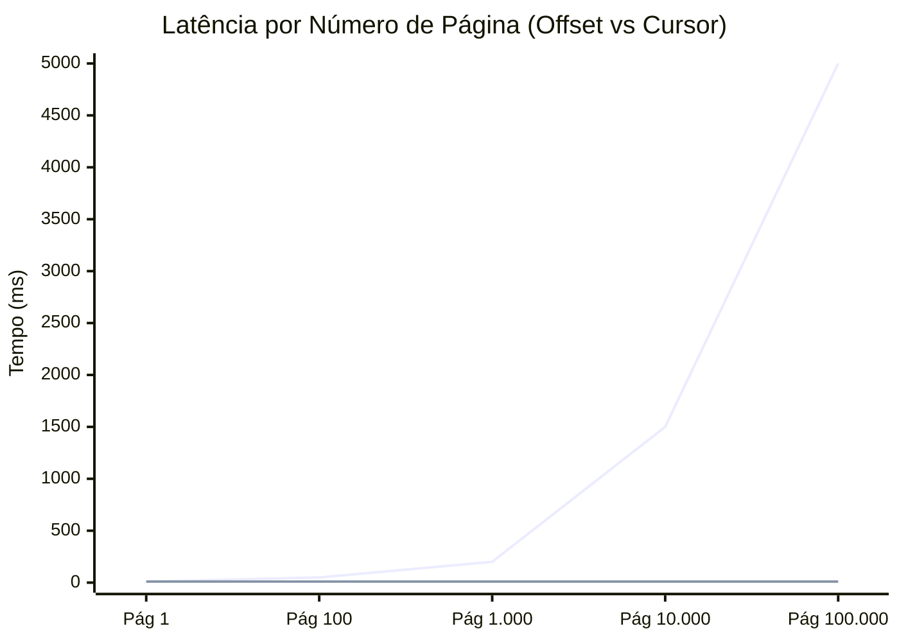
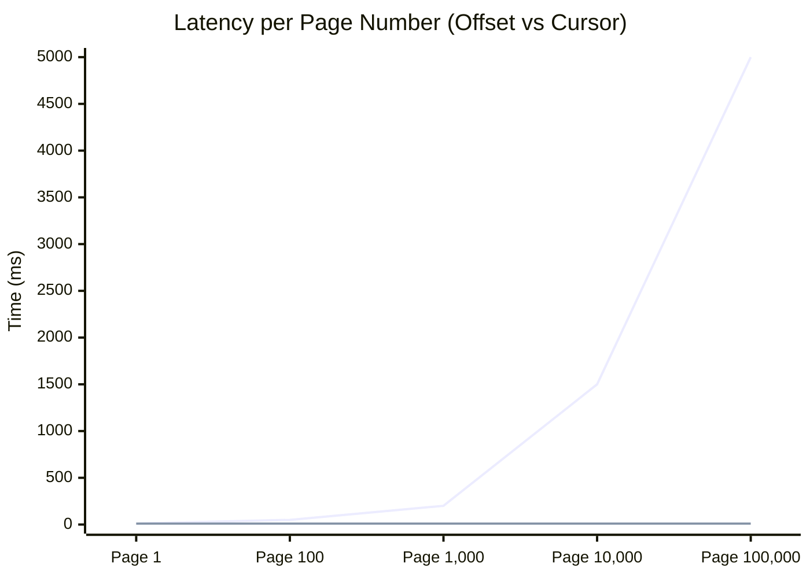

# A Bomba-Relógio da Paginação: Porque `OFFSET` vai matar a sua Base de Dados

Porque é que a página 1 demora 10ms e a página 10.000 demora 10 segundos?

---

Todos nós já escrevemos esta query. É a primeira coisa que aprendemos quando precisamos criar uma tabela com paginação no frontend:

```sql
-- "me de os users da página 10"
SELECT * FROM users
ORDER BY created_at DESC
LIMIT 10 OFFSET 100;
```

Funciona perfeitamente no ambiente de desenvolvimento com 50 registos. Funciona bem em produção durante os primeiros meses.
Mas, à medida que a sua tabela cresce para milhões de linhas, o seu sistema começa a arrastar-se. As chamadas de API começam a dar *timeout*. O CPU da base de dados cola nos 100%.

O culpado? O comando `OFFSET`.
Hoje vamos entender porque a paginação tradicional é ineficiente em escala e como o **Keyset Pagination (Cursor)** é a solução de engenharia correta.

---

### O Custo Oculto do "Pular" Registos

A intuição diz-nos que `OFFSET 100000` diz à base de dados para "saltar magicamente" para a linha 100.000 e começar a ler.
**A realidade é muito mais cruel.**

As bases de dados (Postgres, MySQL, SQL Server) não sabem onde a linha 100.000 está fisicamente no disco sem ler as anteriores.
Para satisfazer um `OFFSET 100000`, o motor da base de dados precisa de:

1.  Encontrar as primeiras 100.000 linhas que satisfazem a ordenação.
2.  Carregá-las (mesmo que parcialmente).
3.  **Deitá-las fora** (descartar).
4.  Retornar as próximas 10.

Isto significa que o esforço para carregar a página 10.000 é 10.000 vezes maior do que para carregar a página 1. A complexidade é **O(N)**, onde N é o número de linhas "saltadas".

#### Visualizando a Degradação

Conforme o número da página aumenta, a latência explode.


* **Linha 1 (Curva Exponencial):** Paginação com Offset.
* **Linha 2 (Plana):** Paginação com Cursor (Keyset).

---

### A Solução: Keyset Pagination (Cursor)

Se o `OFFSET` é o problema, a solução é removê-lo.
O método **Keyset Pagination** (popularizado como "Cursor") baseia-se numa ideia simples: em vez de dizer "pula X linhas", dizemos "dá-me as linhas que vêm **depois** da última que eu vi".

Imagine que ordenamos por `ID`. O último utilizador da Página 1 tinha o `ID = 50`.
Para obter a Página 2, não pedimos "pula 10". Pedimos:

```sql
SELECT * FROM users
WHERE id > 50
ORDER BY id ASC
LIMIT 10;
```

#### Porque é que isto é Rápido?

Esta query permite que a base de dados use um **Índice (B-Tree)** para ir *diretamente* ao valor `50` (Seek) e ler os próximos 10 registos.
Não há descarte de linhas. Não há leitura inútil.
A performance é **O(1)** (constante), ou mais precisamente O(log N) para a busca no índice, independentemente se está a ler a página 1 ou a página 1 milhão.

---

### O Desafio da Ordenação Complexa

"Mas eu não ordeno por ID, ordeno por Data de Criação (`created_at`)."

Aqui surge o problema dos empates. É possível ter dois registos com o mesmo timestamp. Se usar apenas `WHERE created_at < ?`, pode perder dados ou ver duplicados.
A solução é usar uma **chave de desempate determinística**, geralmente o ID.

**A Query Robusta (Cursor):**

```sql
-- Página anterior terminou em: created_at='2023-10-20T10:00:00' e id=450
SELECT * FROM users
WHERE (created_at < '2023-10-20T10:00:00')
   OR (created_at = '2023-10-20T10:00:00' AND id < 450)
ORDER BY created_at DESC, id DESC
LIMIT 10;
```

Isso garante uma ordenação estável e performance máxima, utilizando índices compostos `(created_at, id)`.

---

### Trade-offs: Quando NÃO usar Cursors

Como tudo em engenharia, não existe bala de prata. A paginação por cursor tem limitações claras:

1.  **Sem Acesso Aleatório ("Ir para a Página 5"):**
    Como o cursor depende do valor anterior, não pode calcular a página 5 sem ter passado pela 4.
    * *Veredito:* Ótimo para "Infinite Scroll" (Twitter, Instagram, Feeds). Péssimo para tabelas de administração onde o utilizador quer clicar em "Última Página".

2.  **Complexidade de Implementação:**
    O frontend precisa de receber o "cursor" (o ID/Data do último item) na resposta da API e enviá-lo de volta no próximo pedido. Com `OFFSET`, basta enviar `page=2`.

---

### Conclusão

A paginação por `OFFSET` é uma dívida técnica. É fácil de implementar hoje, mas cobra juros compostos em performance amanhã.

**O Guia de Decisão:**

* **É um Painel de Administração interno?** Tem poucos dados (< 10.000 linhas)? Precisa de botões "Ir para a página X"?
    👉 Use **OFFSET**. É simples e o impacto é negligenciável.

* **É um Feed público, uma API de alto tráfego ou uma tabela com milhões de linhas?**
    👉 Use **Cursor / Keyset**. O `OFFSET` vai derrubar a sua base de dados sob carga.

Engenharia sênior é saber que a query mais simples nem sempre é a query certa em escala.

---

## English Version

We've all written this query. It's the first thing we learn when we need to create a table with pagination on the frontend:

```sql
-- "give me the users from page 10"
SELECT * FROM users
ORDER BY created_at DESC
LIMIT 10 OFFSET 100;
```

It works perfectly in the development environment with 50 records. It works well in production for the first few months.
But, as your table grows to millions of rows, your system starts to crawl. API calls start to *timeout*. The database CPU sticks at 100%.

The culprit? The `OFFSET` command.
Today we're going to understand why traditional pagination is inefficient at scale and how **Keyset Pagination (Cursor)** is the correct engineering solution.

---

### The Hidden Cost of "Skipping" Records

Intuition tells us that `OFFSET 100000` tells the database to "magically jump" to line 100,000 and start reading.
**The reality is much crueler.**

Databases (Postgres, MySQL, SQL Server) don't know where line 100,000 is physically on disk without reading the previous ones.
To satisfy an `OFFSET 100000`, the database engine needs to:

1.  Find the first 100,000 lines that satisfy the ordering.
2.  Load them (even if partially).
3.  **Throw them away** (discard).
4.  Return the next 10.

This means that the effort to load page 10,000 is 10,000 times greater than to load page 1. The complexity is **O(N)**, where N is the number of lines "skipped".

#### Visualizing the Degradation

As the page number increases, latency explodes.


* **Line 1 (Exponential Curve):** Pagination with Offset.
* **Line 2 (Flat):** Pagination with Cursor (Keyset).

---

### The Solution: Keyset Pagination (Cursor)

If `OFFSET` is the problem, the solution is to remove it.
The **Keyset Pagination** method (popularized as "Cursor") is based on a simple idea: instead of saying "skip X lines", we say "give me the lines that come **after** the last one I saw".

Imagine we sort by `ID`. The last user on Page 1 had `ID = 50`.
To get Page 2, we don't ask "skip 10". We ask:

```sql
SELECT * FROM users
WHERE id > 50
ORDER BY id ASC
LIMIT 10;
```

#### Why is this Fast?

This query allows the database to use an **Index (B-Tree)** to go *directly* to the value `50` (Seek) and read the next 10 records.
There is no discarding of lines. There is no useless reading.
The performance is **O(1)** (constant), or more precisely O(log N) for the search in the index, regardless of whether you are reading page 1 or page 1 million.

---

### The Challenge of Complex Sorting

"But I don't sort by ID, I sort by Creation Date (`created_at`)."

Here comes the problem of ties. It is possible to have two records with the same timestamp. If you only use `WHERE created_at < ?`, you may lose data or see duplicates.
The solution is to use a **deterministic tie-breaker key**, usually the ID.

**The Robust Query (Cursor):**

```sql
-- Previous page ended at: created_at='2023-10-20T10:00:00' and id=450
SELECT * FROM users
WHERE (created_at < '2023-10-20T10:00:00')
   OR (created_at = '2023-10-20T10:00:00' AND id < 450)
ORDER BY created_at DESC, id DESC
LIMIT 10;
```

This ensures stable ordering and maximum performance, using compound indexes `(created_at, id)`.

---

### Trade-offs: When NOT to Use Cursors

Like everything in engineering, there is no silver bullet. Cursor pagination has clear limitations:

1.  **No Random Access ("Go to Page 5"):**
    As the cursor depends on the previous value, you cannot calculate page 5 without having gone through page 4.
    * *Verdict:* Great for "Infinite Scroll" (Twitter, Instagram, Feeds). Terrible for administration tables where the user wants to click on "Last Page".

2.  **Implementation Complexity:**
    The frontend needs to receive the "cursor" (the ID/Date of the last item) in the API response and send it back in the next request. With `OFFSET`, just send `page=2`.

---

### Conclusion

Pagination by `OFFSET` is a technical debt. It's easy to implement today, but it charges compound interest in performance tomorrow.

**The Decision Guide:**

* **Is it an internal Administration Panel?** Does it have little data (< 10,000 rows)? Do you need "Go to page X" buttons?
    👉 Use **OFFSET**. It's simple and the impact is negligible.

* **Is it a public Feed, a high-traffic API, or a table with millions of rows?**
    👉 Use **Cursor / Keyset**. The `OFFSET` will bring down your database under load.

Senior engineering is knowing that the simplest query is not always the right query at scale.


---

*This file is automatically generated and backed up from the blog system.*
*Last updated: 2025-12-19T00:11:06.482Z*
