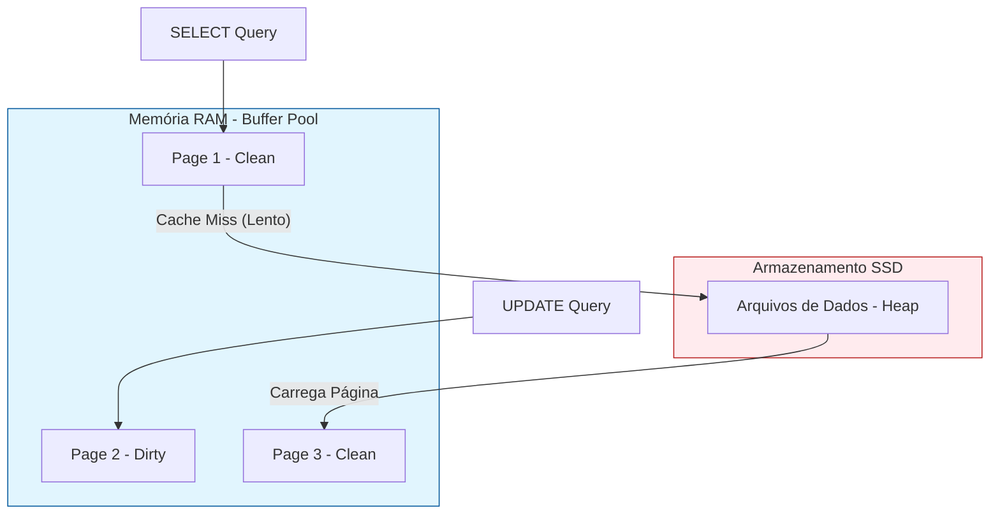
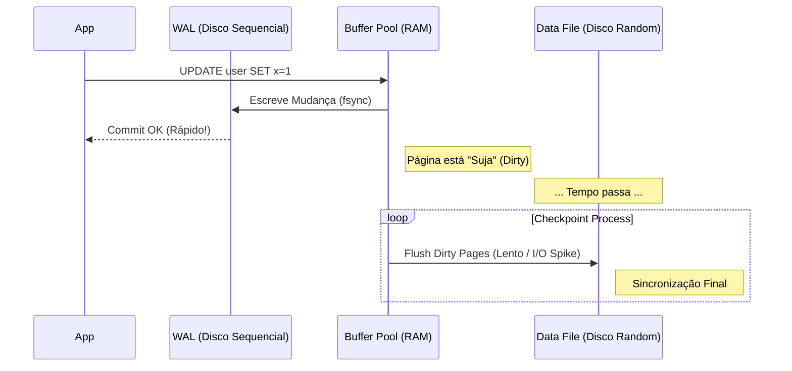
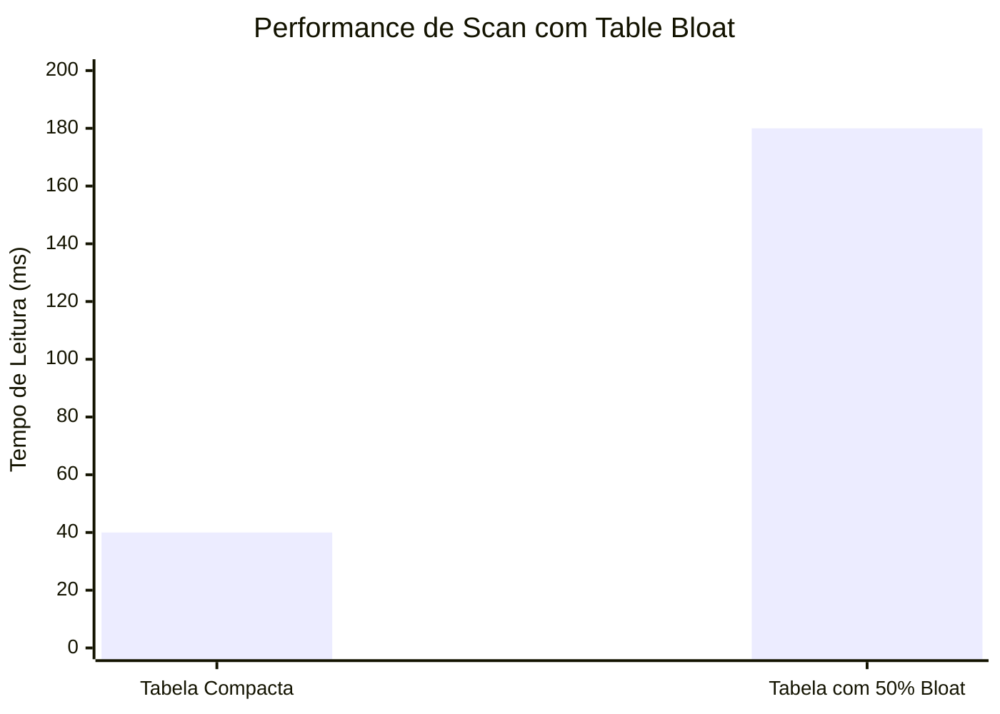

# Além do `CREATE INDEX`: A Física Oculta da Performance de Banco de Dados

Por que entender de Buffer Pool, WAL e MVCC vai salvar sua aplicação quando o SQL Tuning falhar

---

Você analisou o `EXPLAIN ANALYZE`, criou o índice composto perfeito cobrindo todas as colunas da query, e ainda assim, seu banco de dados está "engasgando" sob alta carga. O uso de CPU está alto, o I/O de disco está no teto e a latência está instável.

Bem-vindo ao mundo da **Performance Interna de Banco de Dados**.

Neste nível, não estamos mais falando de otimizar SQL. Estamos falando de gerenciar a memória física (RAM), a física do disco rotacional (ou SSD) e o custo da durabilidade (ACID). Vamos explorar três pilares que separam os meros usuários de banco dos engenheiros de banco: **Buffer Pool**, **WAL** e **MVCC**.

---

### 1. O Buffer Pool: A Batalha pela RAM

A regra número 1 de performance de banco de dados é: **Disco é lava.**
O acesso à memória RAM é medido em nanossegundos. O acesso ao disco (mesmo NVMe) é medido em microssegundos ou milissegundos. É ordens de grandeza mais lento.

O **Buffer Pool** (ou *Shared Buffers* no Postgres) é a área da memória onde o banco mantém as "Páginas" de dados.

#### O Ciclo de Vida de uma Leitura
Quando você faz um `SELECT * FROM users WHERE id = 1`:
1.  O banco verifica se a página contendo esse ID está no **Buffer Pool**.
2.  **Cache Hit:** Se sim, ele retorna direto da memória (Zero I/O físico).
3.  **Cache Miss:** Se não, ele precisa ir ao disco, copiar a página para a memória (evictando outra página se estiver cheio) e então retornar.

#### O Problema: Eviction e Dirty Pages

Se seu Buffer Pool for pequeno demais para seu "Working Set" (os dados acessados frequentemente), o banco entra num ciclo de *Thrashing*: ele joga fora uma página que precisará daqui a pouco para carregar uma nova.

**Dica de Tuning:**
No PostgreSQL, o padrão do `shared_buffers` é conservador (geralmente 128MB). Em servidores dedicados, isso deve ser ajustado para algo entre **25% a 40% da RAM total**.
* *Nota:* Não aloque 100%. O Sistema Operacional precisa de RAM para o "OS Page Cache", que o Postgres também usa como cache de segundo nível.

---

### 2. WAL (Write Ahead Log): O Custo da Verdade

Se o banco escrevesse tudo na memória (Buffer Pool) para ser rápido, o que aconteceria se a luz acabasse? Perda de dados.
Se o banco escrevesse tudo direto no arquivo de dados final no disco, seria lento demais (Random I/O).

A solução é o **WAL (Write Ahead Log)**.

O WAL é um arquivo de "append-only" (escrita sequencial).
Toda vez que você faz um `INSERT` ou `UPDATE`:
1.  O banco escreve a mudança no final do arquivo WAL (Sequencial = Rápido).
2.  O banco altera a página na memória (Buffer Pool).
3.  **Commit:** O banco diz "Sucesso" para o cliente.

O dado **ainda não está** no arquivo de dados principal no disco. Ele está apenas no WAL e na memória.

#### O Checkpoint
Periodicamente, um processo chamado **Checkpointer** acorda, pega todas as "Dirty Pages" da memória e as descarrega para o arquivo de dados definitivo. Isso gera picos de I/O.

**Dica de Tuning:**
Se você tem muitos `UPDATEs` massivos, aumente o `max_wal_size`.
* **Padrão:** Checkpoints frequentes (a cada 5 min ou 1GB). Isso causa soluços na performance.
* **Avançado:** Espaçar os checkpoints (ex: 30 min ou 10GB) suaviza o I/O, distribuindo a carga de escrita ao longo do tempo, ao custo de um *Recovery* mais lento se o servidor reiniciar.

---

### 3. MVCC e o Vacuum: O Fantasma dos Dados Passados

Em bancos como Postgres e Oracle, quando você faz um `UPDATE`, você **não está sobrescrevendo** o dado original.
O que acontece fisicamente é:
1.  O banco marca a linha antiga como "morta" (Dead Tuple) mas a deixa lá.
2.  O banco insere uma **nova versão** da linha.

Isso se chama **MVCC (Multi-Version Concurrency Control)**. É o que permite que alguém leia a tabela enquanto você a atualiza, sem locks de leitura.

#### O Problema: Bloat (Inchaço)
Se você faz muitos updates, sua tabela fica cheia de "linhas mortas". O índice continua apontando para elas. O banco precisa ler páginas cheias de lixo para achar os dados vivos.

O **Autovacuum** é o lixeiro que passa limpando essas linhas mortas para liberar espaço nas páginas.

#### Visualizando o Bloat

**Dica de Tuning:**
O Autovacuum padrão do Postgres é muito "preguiçoso" para sistemas de alta escrita.
* **Sintoma:** A tabela cresce fisicamente em GBs, mas o `count(*)` é o mesmo.
* **Ação:** Torne o autovacuum mais agressivo. Diminua o `autovacuum_vacuum_scale_factor` (de 0.2 para 0.05) em tabelas críticas para limpar a sujeira mais rápido e evitar que as páginas fiquem fragmentadas.

---

### 4. Fillfactor: Trocando Espaço por Performance

Por padrão, quando o Postgres cria uma página de dados (geralmente 8KB), ele tenta enchê-la 100%.

Imagine uma página cheia. Você precisa fazer um `UPDATE` em uma linha que está lá.
Como a página está cheia e o MVCC precisa criar uma nova versão da linha, essa nova versão não cabe na mesma página. Ela vai para uma página nova, longe dali.

Isso quebra o **HOT (Heap Only Tuples)**. Agora, para ler essa linha, o banco precisa buscar duas páginas diferentes. O índice precisa ser atualizado para apontar para o novo local.

**A Técnica Avançada:**
Defina o `fillfactor` para 70% ou 80% em tabelas com muitos updates.
Isso instrui o banco a deixar 20% da página vazia na criação.
Quando houver um `UPDATE`, a nova versão da linha caberá **na mesma página**.
* **Resultado:** Menos I/O, updates mais rápidos e índices menores, pois não precisam ser atualizados (HOT Update).

---

### Conclusão: Engenharia vs. Magia

Performance de banco de dados não é magia negra; é gerenciamento de recursos finitos.
* O **Buffer Pool** evita que você leia do disco.
* O **WAL** permite que você escreva rápido de forma sequencial.
* O **MVCC/Vacuum** gerencia a sujeira deixada pela concorrência.

Antes de culpar o desenvolvedor pela query "mal escrita", olhe para as métricas do seu sistema. Se o *Cache Hit Ratio* estiver baixo, se os *Checkpoints* estiverem acontecendo a cada minuto ou se o *Bloat* estiver alto, nenhum índice no mundo vai salvar sua aplicação.

---

## English Version

You've analyzed the `EXPLAIN ANALYZE`, created the perfect composite index covering all query columns, and yet, your database is "choking" under high load. CPU usage is high, disk I/O is maxed out, and latency is unstable.

Welcome to the world of **Internal Database Performance**.

At this level, we're no longer talking about optimizing SQL. We're talking about managing physical memory (RAM), the physics of rotational disks (or SSDs), and the cost of durability (ACID). We'll explore three pillars that separate mere database users from database engineers: **Buffer Pool**, **WAL**, and **MVCC**.

---

### 1. The Buffer Pool: The Battle for RAM

The number 1 rule of database performance is: **Disk is lava.**
Access to RAM is measured in nanoseconds. Access to disk (even NVMe) is measured in microseconds or milliseconds. It's orders of magnitude slower.

The **Buffer Pool** (or *Shared Buffers* in Postgres) is the memory area where the database keeps data "Pages."

#### The Lifecycle of a Read
When you execute `SELECT * FROM users WHERE id = 1`:
1.  The database checks if the page containing that ID is in the **Buffer Pool**.
2.  **Cache Hit:** If yes, it returns directly from memory (Zero physical I/O).
3.  **Cache Miss:** If not, it needs to go to disk, copy the page to memory (evicting another page if full), and then return.

#### The Problem: Eviction and Dirty Pages

If your Buffer Pool is too small for your "Working Set" (frequently accessed data), the database enters a cycle of *Thrashing*: it discards a page that it will need shortly to load a new one.

**Tuning Tip:**
In PostgreSQL, the `shared_buffers` default is conservative (usually 128MB). On dedicated servers, this should be adjusted to something between **25% to 40% of total RAM**.
* *Note:* Do not allocate 100%. The Operating System needs RAM for the "OS Page Cache," which Postgres also uses as a second-level cache.

---

### 2. WAL (Write Ahead Log): The Cost of Truth

If the database wrote everything to memory (Buffer Pool) to be fast, what would happen if the power went out? Data loss.
If the database wrote everything directly to the final data file on disk, it would be too slow (Random I/O).

The solution is the **WAL (Write Ahead Log)**.

The WAL is an "append-only" file (sequential write).
Every time you perform an `INSERT` or `UPDATE`:
1.  The database writes the change to the end of the WAL file (Sequential = Fast).
2.  The database modifies the page in memory (Buffer Pool).
3.  **Commit:** The database says "Success" to the client.

The data is **not yet** in the main data file on disk. It's only in the WAL and in memory.

#### The Checkpoint
Periodically, a process called **Checkpointer** wakes up, takes all "Dirty Pages" from memory, and flushes them to the definitive data file. This generates I/O spikes.

**Tuning Tip:**
If you have many massive `UPDATEs`, increase `max_wal_size`.
* **Default:** Frequent checkpoints (every 5 min or 1GB). This causes performance hiccups.
* **Advanced:** Spacing out checkpoints (e.g., 30 min or 10GB) smooths out I/O, distributing the write load over time, at the cost of slower *Recovery* if the server restarts.

---

### 3. MVCC and Vacuum: The Ghost of Past Data

In databases like Postgres and Oracle, when you perform an `UPDATE`, you are **not overwriting** the original data.
What physically happens is:
1.  The database marks the old row as "dead" (Dead Tuple) but leaves it there.
2.  The database inserts a **new version** of the row.

This is called **MVCC (Multi-Version Concurrency Control)**. It's what allows someone to read the table while you update it, without read locks.

#### The Problem: Bloat
If you have many updates, your table becomes full of "dead rows." The index continues to point to them. The database needs to read pages full of garbage to find the live data.

**Autovacuum** is the garbage collector that cleans up these dead rows to free up space on the pages.

#### Visualizing Bloat

**Tuning Tip:**
Postgres's default Autovacuum is too "lazy" for high-write systems.
* **Symptom:** The table physically grows in GBs, but the `count(*)` is the same.
* **Action:** Make autovacuum more aggressive. Decrease `autovacuum_vacuum_scale_factor` (from 0.2 to 0.05) on critical tables to clean up garbage faster and prevent pages from becoming fragmented.

---

### 4. Fillfactor: Trading Space for Performance

By default, when Postgres creates a data page (usually 8KB), it tries to fill it 100%.

Imagine a full page. You need to perform an `UPDATE` on a row that's on it.
Since the page is full and MVCC needs to create a new version of the row, this new version doesn't fit on the same page. It goes to a new page, further away.

This breaks **HOT (Heap Only Tuples)**. Now, to read this row, the database needs to fetch two different pages. The index needs to be updated to point to the new location.

**The Advanced Technique:**
Set `fillfactor` to 70% or 80% on tables with many updates.
This instructs the database to leave 20% of the page empty upon creation.
When an `UPDATE` occurs, the new version of the row will fit **on the same page**.
* **Result:** Less I/O, faster updates, and smaller indexes, as they don't need to be updated (HOT Update).

---

### Conclusion: Engineering vs. Magic

Database performance isn't black magic; it's the management of finite resources.
* The **Buffer Pool** prevents you from reading from disk.
* The **WAL** allows you to write quickly in a sequential manner.
* **MVCC/Vacuum** manages the garbage left by concurrency.

Before blaming the developer for a "poorly written" query, look at your system's metrics. If the *Cache Hit Ratio* is low, if *Checkpoints* are happening every minute, or if *Bloat* is high, no index in the world will save your application.

---

*This file is automatically generated and backed up from the blog system.*
*Last updated: 2025-12-04T18:55:41.421Z*
