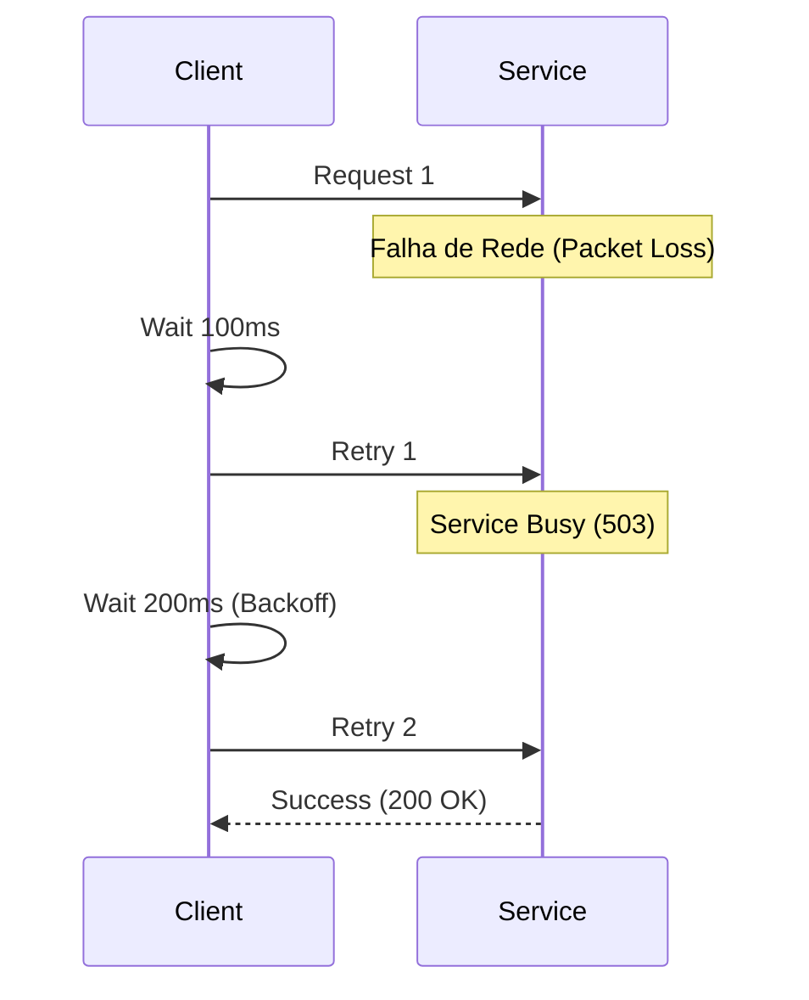
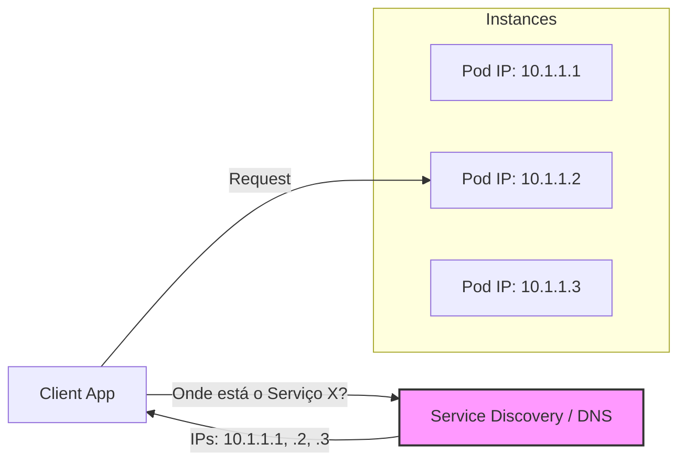
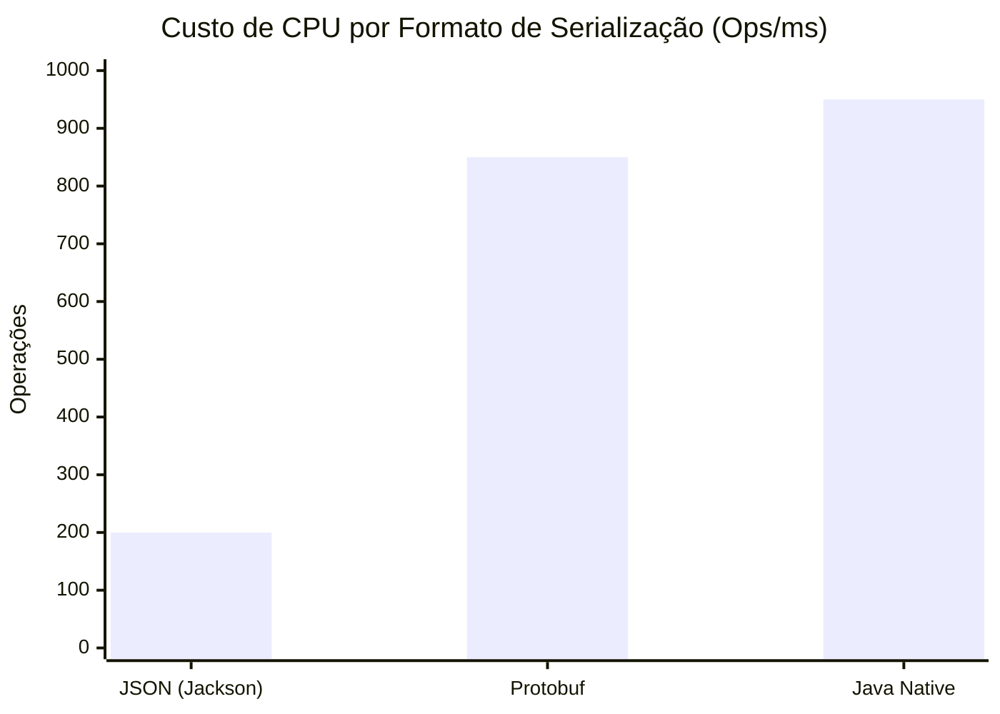
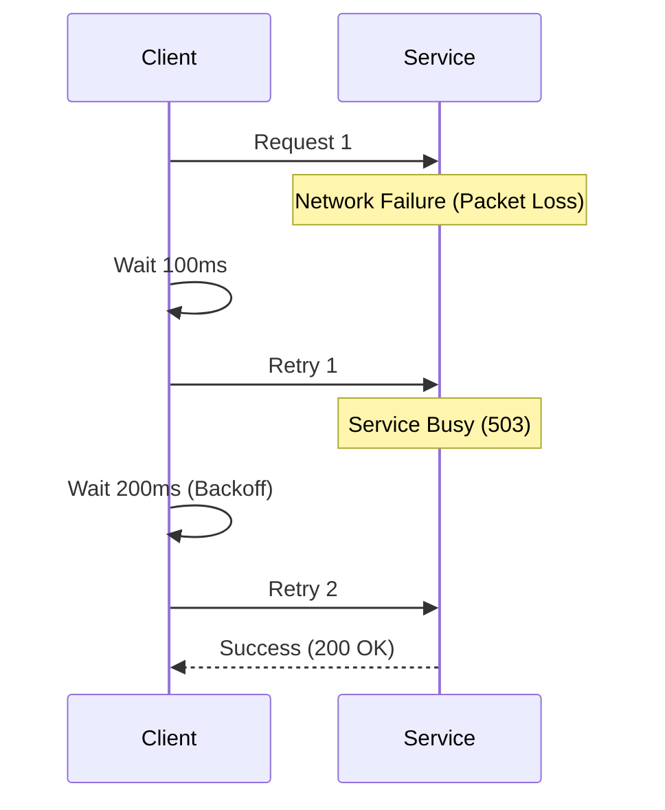
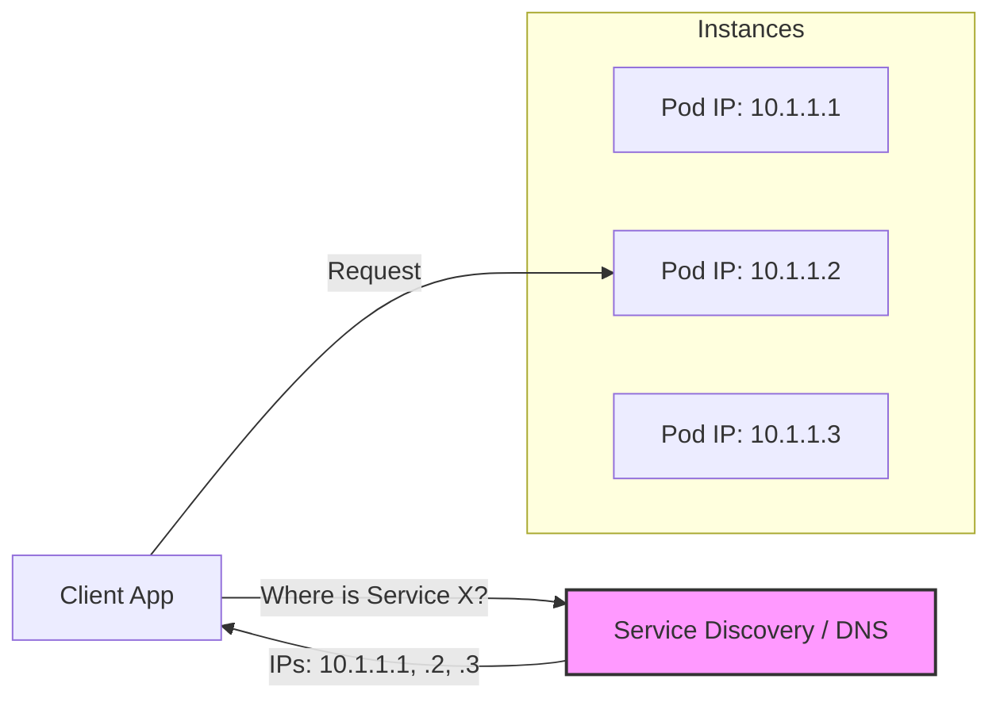
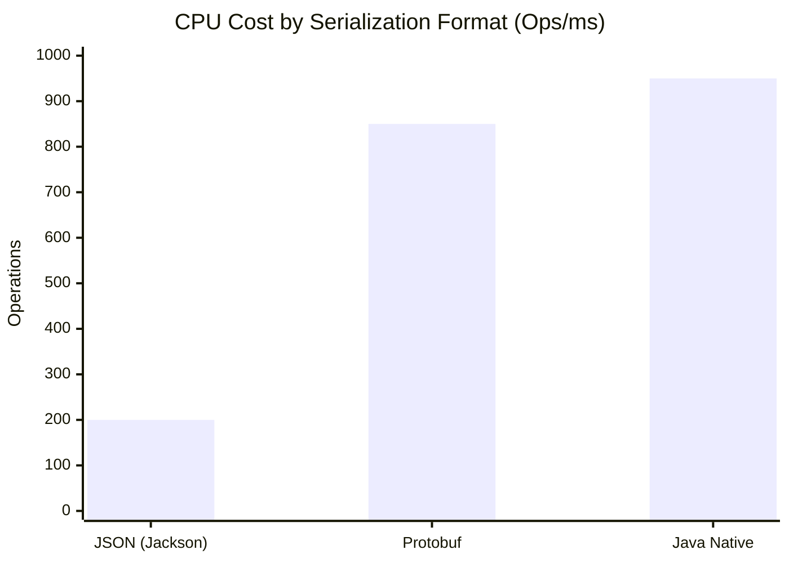

# As 8 Falácias da Computação Distribuída

Por que tratar chamadas HTTP como métodos locais é a receita para o desastre

---

Em 1994, L. Peter Deutsch e seus colegas da Sun Microsystems formalizaram uma lista de premissas falsas que engenheiros assumem ao desenhar sistemas distribuídos. Trinta anos depois, com a nuvem e os microsserviços, essas falácias não apenas continuam reais, como se tornaram **mais perigosas**.

No desenvolvimento de um Monolito, essas premissas geralmente são verdadeiras. Na computação distribuída, acreditar nelas é a causa raiz da maioria dos incidentes de *Downtime* e degradação de performance.

Vamos dissecar cada uma das 8 falácias e, mais importante, como arquitetar suas defesas.

---

### 1. A Rede é Confiável

**A Ilusão:** Se eu enviar um pacote TCP, ele chegará ao destino.
**A Realidade:** Roteadores reiniciam, cabos rompem, regras de firewall mudam sem aviso e pacotes se perdem no limbo.

**Como Resolver:**
Nunca assuma sucesso. Projete para a falha.
* **Timeouts:** Nunca faça uma chamada sem *timeout* (padrão do Java é infinito!).
* **Retries com Exponential Backoff:** Se falhar, tente de novo, mas espere um pouco mais a cada tentativa para não derrubar o serviço de destino (Thundering Herd).
* **Idempotência:** Garanta que processar a mesma mensagem duas vezes não duplique o pedido.

---

### 2. A Latência é Zero

**A Ilusão:** A chamada remota é instantânea.
**A Realidade:** A velocidade da luz é um limite físico. Chamadas entre zonas de disponibilidade (AZs) ou regiões adicionam milissegundos preciosos que se acumulam.

**Como Resolver:**
* **Evite "Chatty Interfaces":** Não faça 10 chamadas para buscar 10 detalhes. Faça 1 chamada que traga os 10 detalhes (Bulkhead/Batching).
* **Data Locality:** Mantenha os dados perto de quem processa (Cache/CDN).
* **Assincronismo:** Se o usuário não precisa da resposta agora, use filas (Kafka/RabbitMQ) para desacoplar a latência do fluxo principal.

---

### 3. A Largura de Banda é Infinita

**A Ilusão:** Posso trafegar JSONs gigantes sem impacto.
**A Realidade:** O *throughput* da rede tem limite físico e custo financeiro (Egress traffic na AWS é caro).

**Como Resolver:**
* **GraphQL / Projections:** Permita que o cliente peça apenas os campos que precisa.
* **Compressão:** Use GZIP/Brotli nos payloads HTTP.
* **Protocolos Eficientes:** Migre comunicação interna (Service-to-Service) para gRPC (Protobuf) em vez de JSON texto.

---

### 4. A Rede é Segura

**A Ilusão:** Estou dentro da VPC/VPN, então ninguém vai interceptar meus dados.
**A Realidade:** A maior parte dos ataques vem de dentro (insiders ou serviços comprometidos). O modelo de "Castelo e Fosso" (Perimeter Security) morreu.

**Como Resolver:**
* **Zero Trust:** Não confie em ninguém, nem na rede interna.
* **mTLS (Mutual TLS):** O serviço A deve apresentar um certificado para falar com o serviço B, e todos os dados devem ser criptografados em trânsito.
* **Service Mesh:** Ferramentas como Istio ou Linkerd facilitam a implementação de mTLS sem mudar o código da aplicação.

---

### 5. A Topologia Não Muda

**A Ilusão:** O servidor de banco de dados sempre estará no IP `10.0.0.55`.
**A Realidade:** No mundo de Containers e Kubernetes, Pods nascem e morrem a cada minuto. IPs são efêmeros.

**Como Resolver:**
* **Service Discovery:** Nunca use IPs fixos (Hardcoded). Use DNS interno (CoreDNS no K8s) ou ferramentas como Consul/Eureka.
* **Client-Side Load Balancing:** O cliente deve saber que existem 3 instâncias do serviço e balancear entre elas.

---

### 6. Existe Apenas Um Administrador

**A Ilusão:** Eu controlo tudo, então sei quando haverá *downtime* para manutenção.
**A Realidade:** Você usa APIs de terceiros (Stripe, Twilio, Auth0) e serviços gerenciados (AWS RDS). Você não controla as janelas de manutenção deles.

**Como Resolver:**
* **Decoupling:** Isole dependências externas com *Wrappers* ou *Adapters*.
* **Feature Flags:** Tenha a capacidade de desligar funcionalidades que dependem de terceiros sem derrubar o site todo (ex: desligar pagamento com cartão e deixar só PIX se a adquirente cair).
* **Observabilidade:** Monitore seus parceiros tanto quanto monitora seus próprios serviços.

---

### 7. O Custo de Transporte é Zero

**A Ilusão:** Serializar um objeto para JSON e enviar pela rede é "de graça" computacionalmente.
**A Realidade:** Serialização/Desserialização (Marshalling) consome muita CPU. Além disso, manter conexões TCP/TLS abertas consome memória.

**Como Resolver:**
* **Formatos Binários:** Avro, Protobuf ou MessagePack são ordens de grandeza mais leves para a CPU processar do que JSON.
* **Connection Pooling:** Reutilize conexões (HikariCP, Keep-Alive) para evitar o custo do *handshake* TCP/SSL a cada requisição.

*(Quanto maior a barra, mais eficiente/menos custo)*

---

### 8. A Rede é Homogênea

**A Ilusão:** Todos os clientes usam a mesma configuração, banda e hardware que o meu servidor de desenvolvimento.
**A Realidade:** Você tem clientes acessando via 4G no metrô, servidores legados que não suportam HTTP/2 e dispositivos IoT com MTU (Maximum Transmission Unit) minúsculo.

**Como Resolver:**
* **Interoperabilidade:** Use padrões abertos (HTTP/REST, gRPC Web).
* **Tolerância:** Teste seu sistema em condições de rede ruins (Chaos Engineering). Use ferramentas como *Toxiproxy* para simular latência e perda de pacotes no ambiente de teste.

---

### Conclusão

Ignorar essas falácias é a principal razão pela qual "funciona na minha máquina" mas falha em produção.

Arquitetar sistemas distribuídos não é sobre evitar que falhas ocorram — isso é impossível. É sobre construir sistemas que **abracem a natureza caótica da rede** e continuem funcionando, mesmo quando a rede mente para você.

Da próxima vez que desenhar uma integração entre serviços, passe por este checklist. Se você marcou todas as 8 caixas, seu sistema sobreviverá à próxima Black Friday.

---

## English Version

In 1994, L. Peter Deutsch and his colleagues at Sun Microsystems formalized a list of false assumptions that engineers make when designing distributed systems. Thirty years later, with the cloud and microservices, these fallacies are not only still real, but have become **more dangerous**.

In monolithic development, these assumptions are often true. In distributed computing, believing them is the root cause of most downtime and performance degradation incidents.

Let's dissect each of the 8 fallacies, and more importantly, how to architect defenses against them.

---

### 1. The Network Is Reliable

**The Illusion:** If I send a TCP packet, it will reach its destination.
**The Reality:** Routers reboot, cables break, firewall rules change without warning, and packets get lost in limbo.

**How to Solve:**
Never assume success. Design for failure.
*   **Timeouts:** Never make a call without a timeout (Java's default is infinite!).
*   **Retries with Exponential Backoff:** If it fails, try again, but wait a bit longer with each attempt to avoid overwhelming the target service (Thundering Herd).
*   **Idempotency:** Ensure that processing the same message twice does not duplicate the request.

---

### 2. Latency Is Zero

**The Illusion:** Remote calls are instantaneous.
**The Reality:** The speed of light is a physical limit. Calls between availability zones (AZs) or regions add precious milliseconds that accumulate.

**How to Solve:**
*   **Avoid "Chatty Interfaces":** Don't make 10 calls to fetch 10 details. Make 1 call that brings all 10 details (Bulkhead/Batching).
*   **Data Locality:** Keep data close to where it's processed (Cache/CDN).
*   **Asynchronicity:** If the user doesn't need the response now, use queues (Kafka/RabbitMQ) to decouple latency from the main flow.

---

### 3. Bandwidth Is Infinite

**The Illusion:** I can transmit giant JSONs without impact.
**The Reality:** Network throughput has physical limits and financial costs (Egress traffic on AWS is expensive).

**How to Solve:**
*   **GraphQL / Projections:** Allow the client to request only the fields it needs.
*   **Compression:** Use GZIP/Brotli on HTTP payloads.
*   **Efficient Protocols:** Migrate internal communication (Service-to-Service) to gRPC (Protobuf) instead of textual JSON.

---

### 4. The Network Is Secure

**The Illusion:** I'm inside the VPC/VPN, so no one will intercept my data.
**The Reality:** Most attacks come from within (insiders or compromised services). The "Castle and Moat" model (Perimeter Security) is dead.

**How to Solve:**
*   **Zero Trust:** Trust no one, not even the internal network.
*   **mTLS (Mutual TLS):** Service A must present a certificate to talk to Service B, and all data must be encrypted in transit.
*   **Service Mesh:** Tools like Istio or Linkerd facilitate mTLS implementation without changing application code.

---

### 5. Topology Doesn't Change

**The Illusion:** The database server will always be at IP `10.0.0.55`.
**The Reality:** In the world of Containers and Kubernetes, Pods are born and die every minute. IPs are ephemeral.

**How to Solve:**
*   **Service Discovery:** Never use fixed (Hardcoded) IPs. Use internal DNS (CoreDNS in K8s) or tools like Consul/Eureka.
*   **Client-Side Load Balancing:** The client should know that there are 3 instances of the service and balance between them.

---

### 6. There Is Only One Administrator

**The Illusion:** I control everything, so I know when there will be downtime for maintenance.
**The Reality:** You use third-party APIs (Stripe, Twilio, Auth0) and managed services (AWS RDS). You don't control their maintenance windows.

**How to Solve:**
*   **Decoupling:** Isolate external dependencies with Wrappers or Adapters.
*   **Feature Flags:** Have the capability to disable functionalities that depend on third parties without bringing down the entire site (e.g., disable credit card payments and only allow Pix if the acquirer goes down).
*   **Observability:** Monitor your partners as much as you monitor your own services.

---

### 7. Transport Cost Is Zero

**The Illusion:** Serializing an object to JSON and sending it over the network is computationally "free".
**The Reality:** Serialization/Deserialization (Marshalling) consumes a lot of CPU. Additionally, keeping TCP/TLS connections open consumes memory.

**How to Solve:**
*   **Binary Formats:** Avro, Protobuf, or MessagePack are orders of magnitude lighter for the CPU to process than JSON.
*   **Connection Pooling:** Reuse connections (HikariCP, Keep-Alive) to avoid the cost of the TCP/SSL handshake for each request.

*(The higher the bar, the more efficient/less costly)*

---

### 8. The Network Is Homogeneous

**The Illusion:** All clients use the same configuration, bandwidth, and hardware as my development server.
**The Reality:** You have clients accessing via 4G on the subway, legacy servers that don't support HTTP/2, and IoT devices with tiny MTU (Maximum Transmission Unit).

**How to Solve:**
*   **Interoperability:** Use open standards (HTTP/REST, gRPC Web).
*   **Tolerance:** Test your system in poor network conditions (Chaos Engineering). Use tools like *Toxiproxy* to simulate latency and packet loss in the test environment.

---

### Conclusion

Ignoring these fallacies is the main reason why "it works on my machine" but fails in production.

Architecting distributed systems is not about preventing failures from happening — that's impossible. It's about building systems that **embrace the chaotic nature of the network** and continue working, even when the network lies to you.

Next time you design a service integration, go through this checklist. If you've checked all 8 boxes, your system will survive the next Black Friday.

---

*This file is automatically generated and backed up from the blog system.*
*Last updated: 2025-12-04T18:36:51.104Z*
