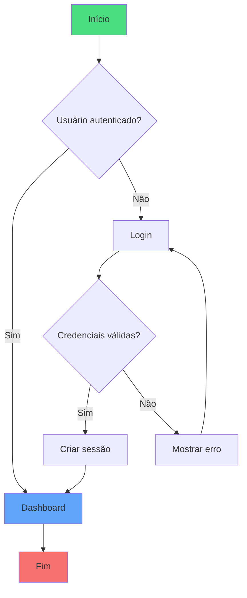
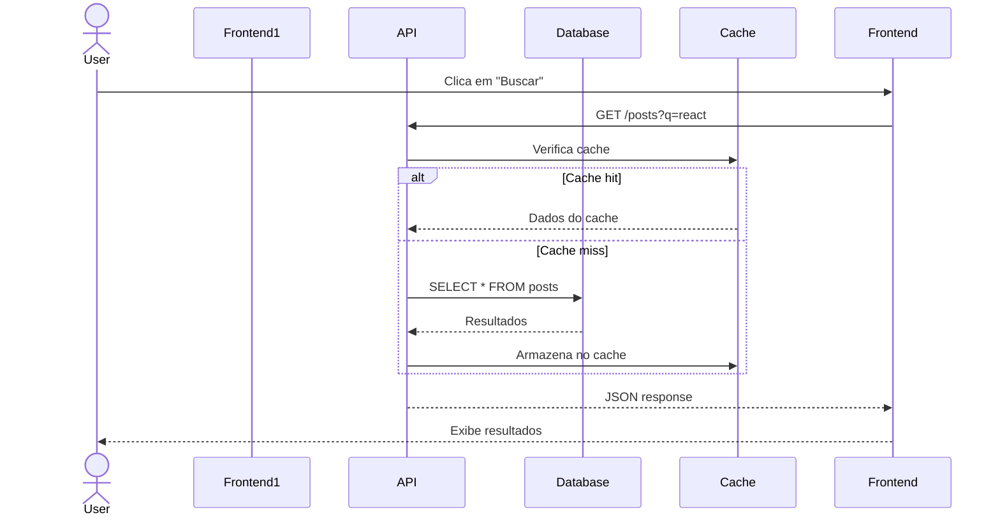
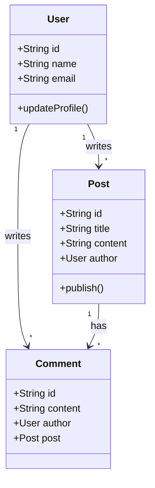
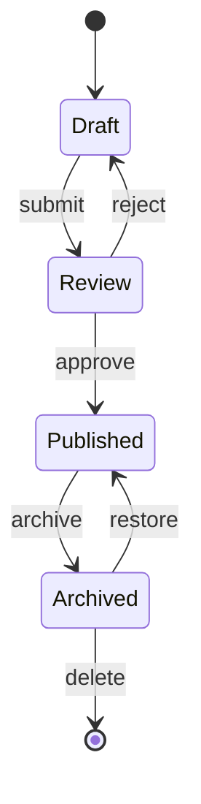
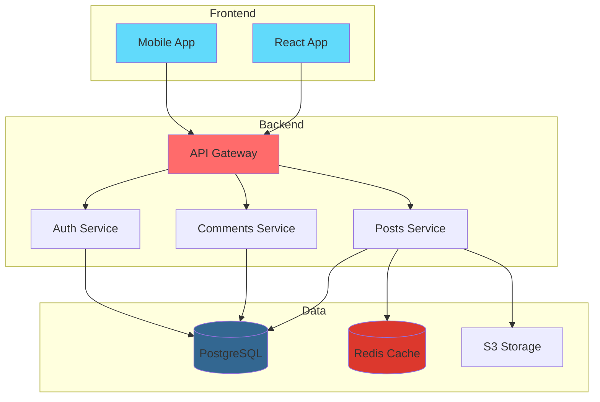

# Visualizando Arquitetura de Software com Diagramas

Aprenda a criar diagramas interativos para documentar e comunicar a arquitetura do seu software de forma clara e efetiva.

---

Diagramas são essenciais para comunicar e documentar a arquitetura de software de forma clara.

## Por que usar diagramas?

Diagramas ajudam a:
- Comunicar ideias complexas de forma visual
- Documentar decisões de arquitetura
- Onboarding de novos membros
- Identificar problemas de design

## Fluxograma de Decisão

## Diagrama de Sequência

Mostra a interação entre componentes ao longo do tempo:

## Diagrama de Classes

Representa a estrutura de classes do sistema:

## Diagrama de Estados

Útil para modelar ciclo de vida de entidades:

## Diagrama de Arquitetura

Visão geral de um sistema distribuído:

## Conclusão

Use diagramas para documentar seu software. Eles facilitam a comunicação e ajudam a manter o conhecimento da arquitetura acessível a toda a equipe.

---

## English Version

*No English content yet*

---

*This file is automatically generated and backed up from the blog system.*
*Last updated: 2025-12-03T17:45:55.363Z*
