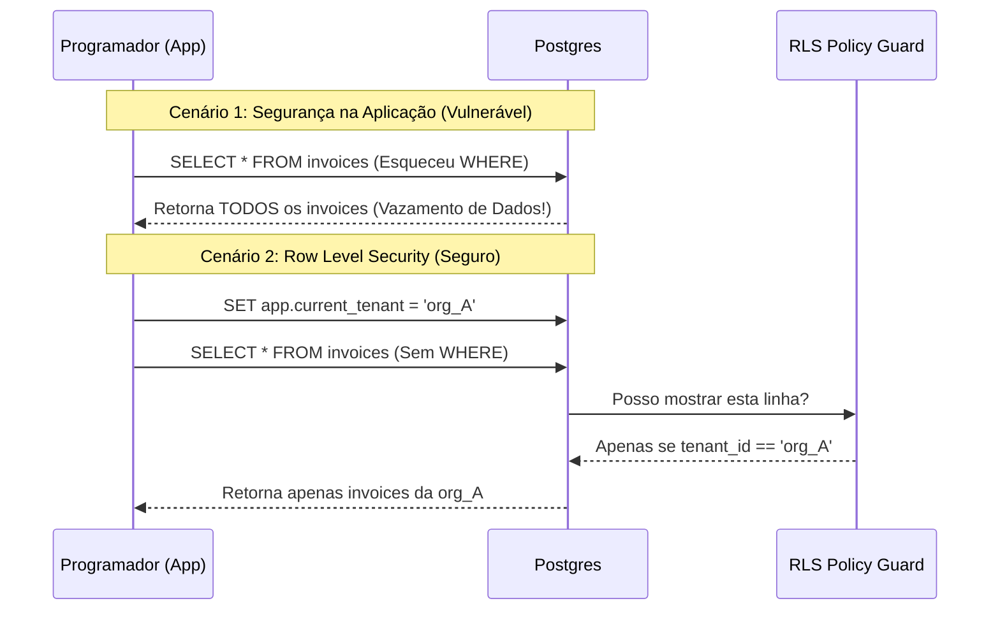
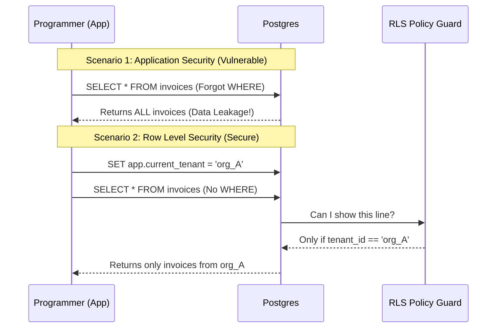

# O Dilema do Multi-tenant: Porque confiar no `WHERE tenant_id = ?` vai destruir o seu SaaS

Deixe o Banco de Dados proteger os dados, não o seu código cansado das 3 da manhã

---

Se está a construir um SaaS B2B, a primeira decisão de arquitetura é inevitável: **Multi-tenancy**.
Para manter os custos baixos e a agilidade alta, todos os clientes (Tenants) partilham a mesma base de dados e as mesmas tabelas.

A solução "padrão" que 90% dos tutoriais ensinam é simples: adicione uma coluna `tenant_id` em todas as tabelas e filtre sempre.

```sql
-- A query que sustenta 90% dos MicroSaaS
SELECT * FROM invoices WHERE tenant_id = 'org_123';
```

Parece seguro. Funciona nos testes. Mas esta abordagem baseia-se numa premissa frágil: **a infalibilidade do programador**.
Basta **um** esquecimento, numa única rota de API, para que o Cliente A visualize todos os dados financeiros do Cliente B.

Neste artigo, vamos explorar porque a segurança ao nível da aplicação é uma bomba-relógio e como o **Row Level Security (RLS)** do Postgres é a única vacina real.

---

### A Falácia da Disciplina do Programador

Imagine que o seu SaaS cresceu. Agora tem 50 tabelas e 200 endpoints.
Em *todas* as queries, inserts e updates, o programador deve lembrar-se de adicionar `AND tenant_id = ?`.

**O cenário de pesadelo:**
É sexta-feira à noite. Precisa de lançar uma "hotfix" rápida para uma listagem de utilizadores. Na pressa, escreve:

```javascript
// O bug de 1 milhão de euros
const users = await db.query("SELECT * FROM users"); // Esqueceu-se do WHERE!
res.json(users);
```

O código compila. O código corre. Não há erros de sintaxe.
Mas acabou de cometer uma violação de dados (Data Breach). A reputação do seu SaaS, construída ao longo de anos, evapora em segundos.

A segurança baseada em "não se esquecer do WHERE" não escala e não é resiliente a erros humanos.

---

### A Solução: Row Level Security (RLS)

E se o próprio banco de dados soubesse quem é o utilizador e recusasse entregar dados que não lhe pertencem, mesmo que o programador pedisse?

É exatamente isso que o **Postgres Row Level Security (RLS)** faz. É como uma firewall, mas para cada linha da tabela.

Em vez de confiar no código da aplicação (`Node.js`/`Python`), define-se uma **Política (Policy)** diretamente na base de dados.

#### Como funciona na prática?

1.  **Ativar o RLS na Tabela:**
    ```sql
    ALTER TABLE invoices ENABLE ROW LEVEL SECURITY;
    ```

2.  **Criar a Política de Segurança:**
    ```sql
    CREATE POLICY "Tenant Isolation" ON invoices
    USING (tenant_id = current_setting('app.current_tenant')::uuid);
    ```

3.  **A Magia na Aplicação:**
    Agora, no seu backend, a query simplifica-se:

    ```sql
    -- Antes da query, define-se o contexto (apenas uma vez por pedido)
    SET app.current_tenant = 'org_123';

    -- O programador pode ser "preguiçoso" ou esquecido:
    SELECT * FROM invoices;
    ```

    **Resultado:** O Postgres retorna **apenas** as linhas onde `tenant_id` coincide com a configuração da sessão. Se tentar ler dados de outro tenant, o banco retorna vazio, como se os dados não existissem.

---

### Visualizando a Diferença

Vamos comparar o fluxo vulnerável com o fluxo protegido por RLS.



---

### O Fator Supabase / Next.js

Se está a utilizar ferramentas modernas como o **Supabase**, o RLS não é apenas uma opção; é o padrão.
O Supabase facilita ainda mais este processo, integrando o RLS com a autenticação JWT.

A política torna-se algo como:

```sql
CREATE POLICY "Users can only see their own data" ON todos
FOR SELECT USING (
  auth.uid() = user_id
);
```

Aqui, o `auth.uid()` é extraído automaticamente do token JWT do utilizador logado. O seu frontend pode consultar a base de dados diretamente (`supabase.from('todos').select()`) sem risco, pois o motor do banco garante a segregação.

---

### Os "Contrapartidas" (Trade-offs)

Nem tudo é perfeito. Adicionar lógica dentro da base de dados tem custos:

1.  **Performance:** O banco precisa de avaliar a política para cada linha. Em tabelas com milhões de registos, se a política for complexa (ex: joins dentro da política), pode haver impacto na performance. Índices adequados no `tenant_id` são obrigatórios.
2.  **Testabilidade:** Os seus testes unitários precisam de simular o contexto da base de dados (`SET app.current_tenant`) para funcionarem corretamente.
3.  **Complexidade de Debug:** Às vezes, uma query retorna vazio e não sabe porquê. Geralmente, é o RLS a fazer o seu trabalho silenciosamente.

---

### Conclusão

No mundo do MicroSaaS, a velocidade é vida, mas a segurança é sobrevivência.

Implementar o isolamento de dados no nível da aplicação (`WHERE`) é como deixar a porta de casa destrancada e confiar que ninguém vai rodar a maçaneta. Funciona, até ao dia em que alguém roda.

O **Row Level Security** move a responsabilidade da segurança do nível cognitivo (memória do programador) para o nível infraestrutural (garantia matemática do banco).

Se está a começar um novo projeto hoje, ative o RLS. O seu "eu" do futuro — aquele que vai estar a dormir descansado às 3 da manhã — agradecer-lhe-á.

---

## English Version

If you're building a B2B SaaS, the first architectural decision is inevitable: **Multi-tenancy**.
To keep costs low and agility high, all clients (Tenants) share the same database and the same tables.

The "standard" solution that 90% of tutorials teach is simple: add a `tenant_id` column to all tables and always filter.

```sql
-- The query that supports 90% of MicroSaaS
SELECT * FROM invoices WHERE tenant_id = 'org_123';
```

It seems safe. It works in tests. But this approach relies on a fragile premise: **the infallibility of the programmer**.
Just **one** oversight, in a single API route, is enough for Client A to view all of Client B's financial data.

In this article, we will explore why application-level security is a ticking time bomb and how Postgres **Row Level Security (RLS)** is the only real vaccine.

---

### The Fallacy of Programmer Discipline

Imagine your SaaS has grown. Now you have 50 tables and 200 endpoints.
In *every* query, insert and update, the programmer must remember to add `AND tenant_id = ?`.

**The nightmare scenario:**
It's Friday night. You need to release a quick "hotfix" for a user listing. In a hurry, you write:

```javascript
// The million-euro bug
const users = await db.query("SELECT * FROM users"); // Forgot the WHERE!
res.json(users);
```

The code compiles. The code runs. There are no syntax errors.
But you just committed a Data Breach. The reputation of your SaaS, built over years, evaporates in seconds.

Security based on "don't forget the WHERE" doesn't scale and isn't resilient to human error.

---

### The Solution: Row Level Security (RLS)

What if the database itself knew who the user was and refused to deliver data that doesn't belong to them, even if the programmer asked?

That's exactly what **Postgres Row Level Security (RLS)** does. It's like a firewall, but for each row of the table.

Instead of relying on the application code (`Node.js`/`Python`), you define a **Policy** directly in the database.

#### How does it work in practice?

1.  **Enable RLS on the Table:**
    ```sql
    ALTER TABLE invoices ENABLE ROW LEVEL SECURITY;
    ```

2.  **Create the Security Policy:**
    ```sql
    CREATE POLICY "Tenant Isolation" ON invoices
    USING (tenant_id = current_setting('app.current_tenant')::uuid);
    ```

3.  **The Magic in the Application:**
    Now, in your backend, the query simplifies:

    ```sql
    -- Before the query, the context is defined (only once per request)
    SET app.current_tenant = 'org_123';

    -- The programmer can be "lazy" or forgetful:
    SELECT * FROM invoices;
    ```

    **Result:** Postgres returns **only** the rows where `tenant_id` matches the session configuration. If you try to read data from another tenant, the database returns empty, as if the data didn't exist.

---

### Visualizing the Difference

Let's compare the vulnerable flow with the RLS-protected flow.



---

### The Supabase / Next.js Factor

If you are using modern tools like **Supabase**, RLS is not just an option; it's the default.
Supabase further simplifies this process by integrating RLS with JWT authentication.

The policy becomes something like:

```sql
CREATE POLICY "Users can only see their own data" ON todos
FOR SELECT USING (
  auth.uid() = user_id
);
```

Here, `auth.uid()` is automatically extracted from the logged-in user's JWT token. Your frontend can query the database directly (`supabase.from('todos').select()`) without risk, as the database engine guarantees segregation.

---

### The Trade-offs

Not everything is perfect. Adding logic inside the database has costs:

1.  **Performance:** The database needs to evaluate the policy for each row. In tables with millions of records, if the policy is complex (e.g., joins within the policy), there may be an impact on performance. Appropriate indexes on `tenant_id` are mandatory.
2.  **Testability:** Your unit tests need to simulate the database context (`SET app.current_tenant`) to work correctly.
3.  **Debug Complexity:** Sometimes, a query returns empty and you don't know why. Usually, it's RLS silently doing its job.

---

### Conclusion

In the world of MicroSaaS, speed is life, but security is survival.

Implementing data isolation at the application level (`WHERE`) is like leaving your front door unlocked and trusting that no one will turn the knob. It works, until the day someone turns it.

**Row Level Security** moves the security responsibility from the cognitive level (programmer's memory) to the infrastructural level (mathematical guarantee of the database).

If you are starting a new project today, enable RLS. Your future self — the one who will be sleeping soundly at 3 a.m. — will thank you.


---

*This file is automatically generated and backed up from the blog system.*
*Last updated: 2025-12-16T02:50:27.923Z*
