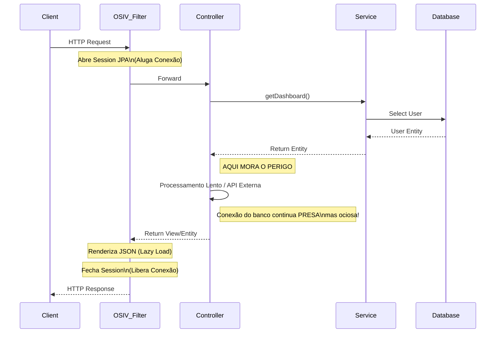
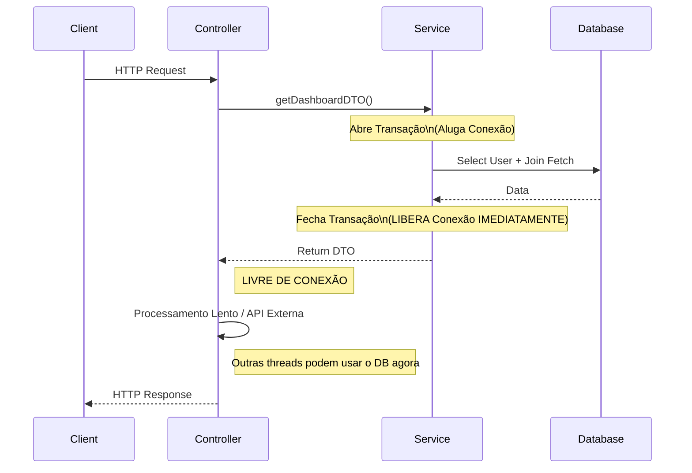
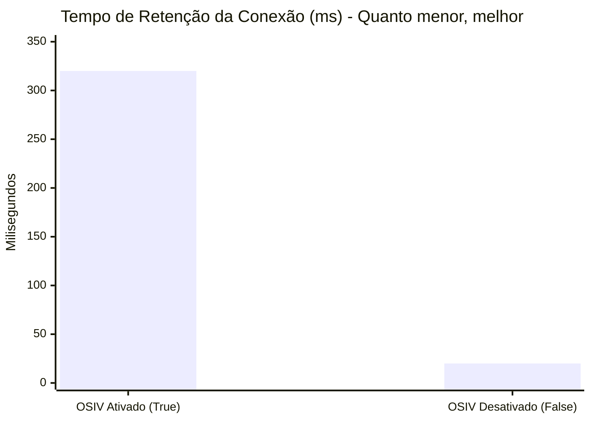
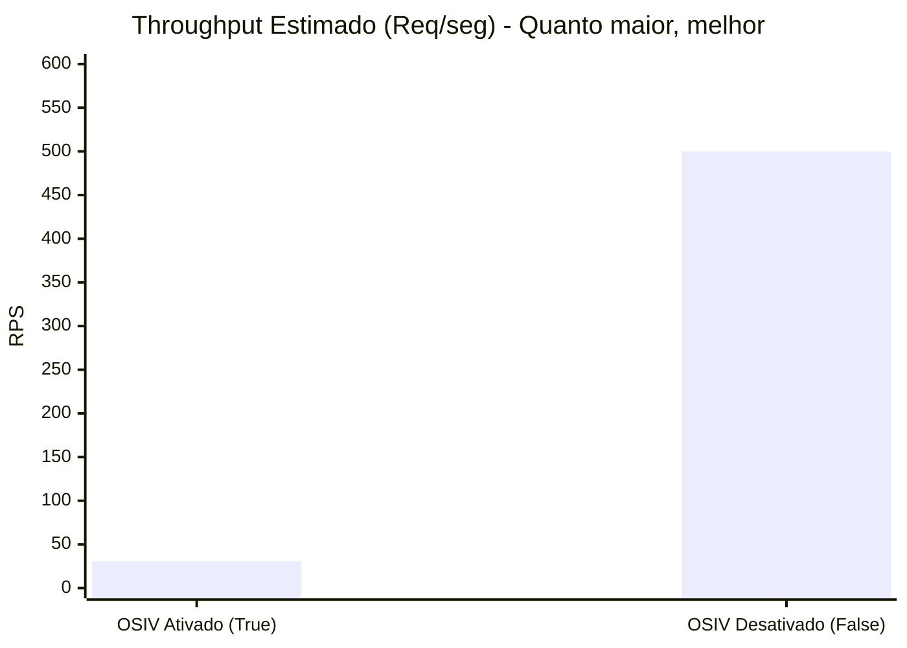
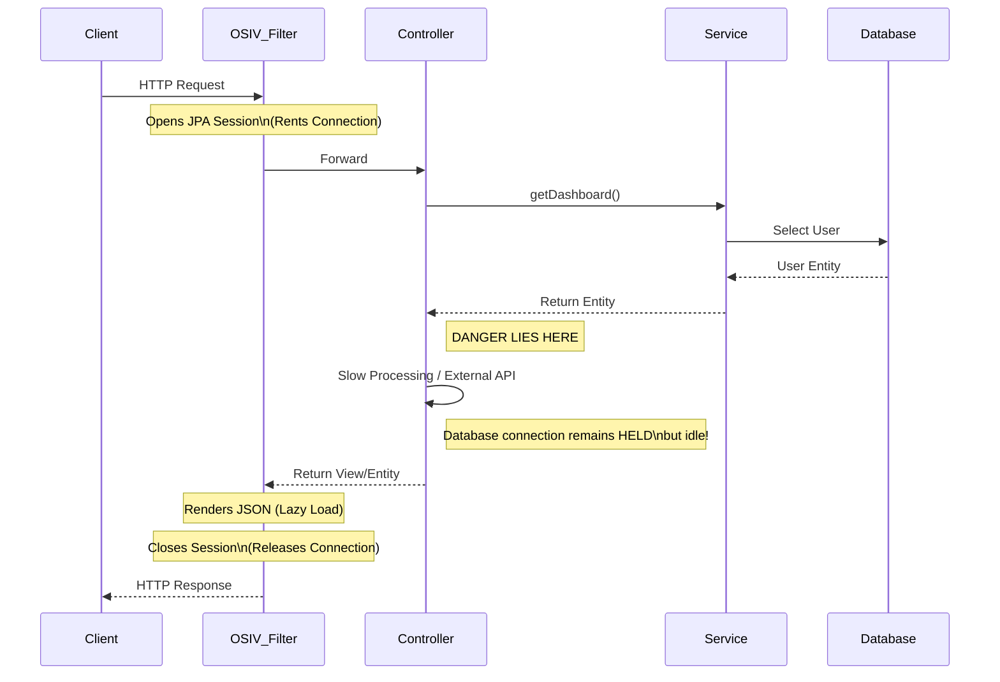
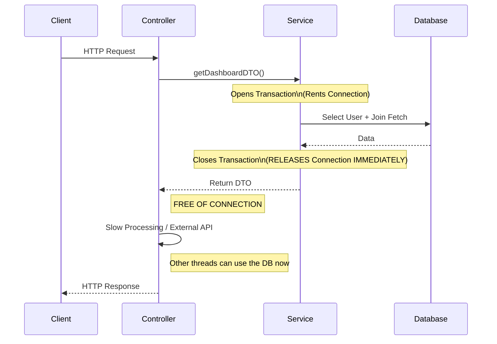
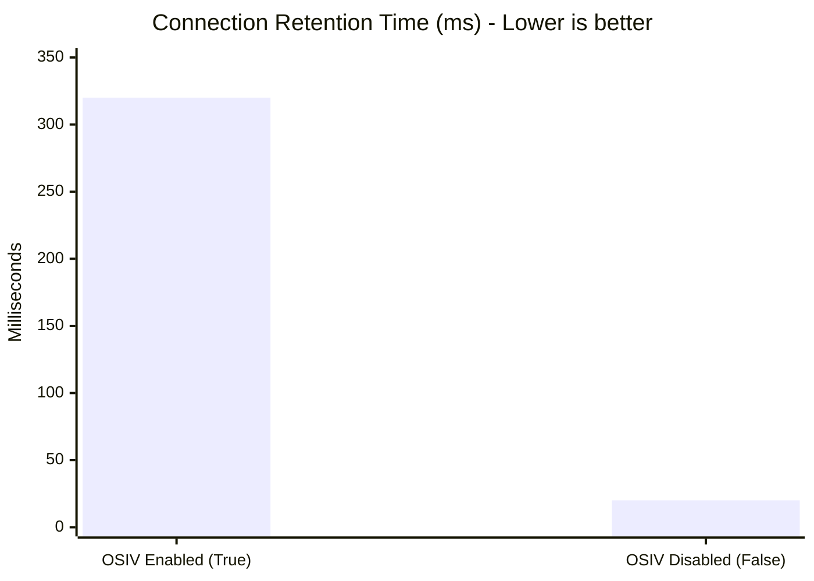
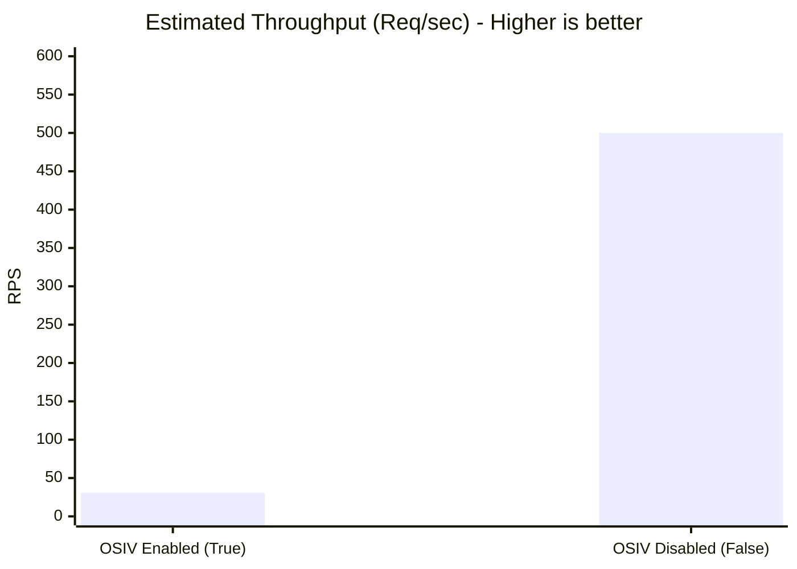

# O Gargalo Invisível: Por que desativar o `Spring Open-in-View` vai salvar a performance da sua API

Se você criou um projeto Spring Boot usando o Spring Initializr e incluiu o `spring-boot-starter-data-jpa`, existe uma configuração padrão ativa na sua aplicação agora mesmo que pode estar silenciosamente matando a escalabilidade do seu sistema.

O nome dela é `spring.jpa.open-in-view` (OSIV), e por padrão, ela é `true`.

Neste artigo, vamos dissecar o que é o OSIV, por que ele é conveniente no início mas desastroso em escala, e provar com gráficos como desligá-lo pode multiplicar o throughput da sua aplicação.

---

## O que é o Open Session In View (OSIV)?

Para entender o OSIV, precisamos lembrar do pesadelo de todo desenvolvedor Java júnior: a `LazyInitializationException`.

Isso ocorre quando você carrega uma entidade (ex: `Cliente`) que possui uma lista carregada sob demanda (ex: `@OneToMany List<Pedidos>`), fecha a transação do banco, e *depois* tenta acessar `cliente.getPedidos()` na camada de View ou Controller. Como a sessão do Hibernate já morreu, o proxy falha.

### A "Solução Mágica" do Spring Boot
Para evitar que sua aplicação quebre logo no "Hello World", o Spring Boot mantém a **Sessão do Hibernate (e a conexão com o banco de dados) aberta** durante **todo o ciclo de vida da requisição HTTP**.

Isso significa que a conexão é aberta quando o request bate no filtro do Servlet e só é fechada depois que o JSON é serializado e enviado para o cliente.

---

## O Problema Arquitetural: O Sequestro da Conexão

O problema do OSIV não é funcionalidade, é **gestão de recursos**. Conexões de banco de dados são caras e limitadas (geralmente gerenciadas por um pool como o HikariCP).

Quando o OSIV está ligado, a thread da requisição "aluga" uma conexão do pool muito cedo e a devolve muito tarde.

### O Cenário do Desastre
Imagine um endpoint que busca os dados de um usuário no banco e, em seguida, consulta uma API externa lenta (ex: Score de Crédito ou Gateway de Pagamento) que demora 500ms.

**Fluxo com OSIV Ativado (`true`):**

1. Request chega.
2. **Spring abre Sessão e aluga conexão do DB.**
3. Service busca Usuário no DB (rápido: 10ms).
4. Service retorna entidade Usuário.
5. Controller chama API externa de Crédito (lento: 500ms). **A conexão do DB continua presa aqui, sem fazer nada!**
6. Controller retorna resposta.
7. Jackson serializa o JSON.
8. **Spring fecha Sessão e devolve conexão.**

*Tempo total de retenção da conexão:* ~510ms.

**Fluxo com OSIV Desativado (`false`):**

1. Request chega.
2. Controller chama Service.
3. **Service abre transação e aluga conexão.**
4. Service busca Usuário (10ms).
5. **Service fecha transação e DEVOLVE conexão.**
6. Controller recebe DTO.
7. Controller chama API externa de Crédito (500ms). **Nenhuma conexão de banco presa.**
8. Resposta enviada.

*Tempo total de retenção da conexão:* ~10ms.

---

## Visualizando o Problema (Diagramas de Sequência)

Vamos visualizar a diferença brutal no ciclo de vida da conexão.

### Arquitetura com OSIV (O Padrão)



### Arquitetura "Clean" (OSIV False)


---

## Estudo de Caso: Análise de Performance

Vamos simular o impacto disso sob carga.

**Configuração do Teste:**
* **Pool de Conexões (Hikari):** 10 conexões máx.
* **Query no Banco:** 20ms.
* **Processamento Externo (Controller):** 300ms.
* **Carga:** 50 usuários simultâneos.

### 1. Tempo de Conexão Indisponível (Lease Time)
Este gráfico mostra por quanto tempo uma única conexão fica fora do pool para atender uma única requisição.



**Análise:** Com o OSIV ligado, cada requisição segura a conexão por 320ms (20ms do banco + 300ms do processamento). Desligado, ela segura apenas pelos 20ms necessários.

### 2. Throughput (Requisições por Segundo)
Como o pool tem apenas 10 conexões, com o OSIV ligado, rapidamente esgotamos o pool. As novas requisições ficam na fila esperando (Connection Starvation), mesmo que a CPU esteja sobrando, porque as conexões estão presas esperando o processamento externo.



**O Resultado:**
* **Com OSIV:** ~30 RPS. O banco se torna o gargalo artificial.
* **Sem OSIV:** ~500 RPS. O gargalo real passa a ser o processamento ou a CPU, não o acesso ao banco. **Um ganho de mais de 15x neste cenário.**

---

## Como Migrar (Sem Quebrar Tudo)

Convencido a desligar? Ótimo. Mas cuidado: se você apenas mudar a flag para `false`, seu log vai ficar vermelho de `LazyInitializationException`.

Para trabalhar sem OSIV, você precisa garantir que os dados necessários estejam carregados **antes** de sair da camada de `@Service` (ou seja, antes de fechar a transação).

### Passo 1: Desligue no properties
No seu `application.properties` ou `application.yml`:

```properties
spring.jpa.open-in-view=false
```

### Passo 2: Use DTOs (Data Transfer Objects)
Nunca retorne Entidades JPA (`@Entity`) no seu Controller. Entidades são espelhos do banco, DTOs são contratos de API.

Mapeie a entidade para um DTO dentro do Service. Isso força o carregamento dos dados enquanto a sessão está aberta.

```java
// Errado (Depende de OSIV se getPedidos for Lazy)
@GetMapping("/{id}")
public Cliente get(@PathVariable Long id) {
    return repository.findById(id).get(); 
}

// Certo (Seguro e Performático)
@GetMapping("/{id}")
public ClienteDTO get(@PathVariable Long id) {
    return service.buscarClienteComPedidos(id); // Retorna DTO já populado
}
```

### Passo 3: Resolva o N+1 com EntityGraphs
Se você precisar carregar listas, não deixe o Hibernate fazer "ping-pong" no banco. Use `JOIN FETCH` ou `@EntityGraph`.

```java
public interface ClienteRepository extends JpaRepository<Cliente, Long> {
    
    // Carrega 'pedidos' em uma única query
    @EntityGraph(attributePaths = {"pedidos"})
    Optional<Cliente> findById(Long id);
}
```
---

## Conclusão

Manter o `spring.jpa.open-in-view=true` é como deixar o taxímetro rodando enquanto você entra no shopping para jantar. Você está pagando caro por um recurso que não está usando ativamente.

Desativar essa configuração exige um design de código mais maduro (uso de DTOs e limites transacionais claros), mas é o passo fundamental para transformar uma aplicação Spring Boot "brinquedo" em um sistema de alta performance capaz de suportar milhares de requisições simultâneas sem engasgar o banco de dados.

Se sua aplicação sofre com timeouts de conexão (`Connection is not available, request timed out after...`) e o banco de dados parece tranquilo na monitoria de CPU, as chances são altas de que o OSIV seja o culpado.

**Desligue-o hoje e veja suas métricas agradecerem.**

---

## English Version

## What is Open Session In View (OSIV)?

To understand OSIV, we need to recall the nightmare of every junior Java developer: the `LazyInitializationException`.

This occurs when you load an entity (e.g., `Client`) that has a lazily loaded list (e.g., `@OneToMany List<Orders>`), close the database transaction, and *then* try to access `client.getOrders()` in the View or Controller layer. Since the Hibernate session is already closed, the proxy fails.

### Spring Boot's "Magic Solution"
To prevent your application from breaking right in the "Hello World," Spring Boot keeps the **Hibernate Session (and the database connection) open** for the **entire HTTP request lifecycle**.

This means the connection is opened when the request hits the Servlet filter and is only closed after the JSON is serialized and sent to the client.

---

## The Architectural Problem: Connection Hijacking

The problem with OSIV is not functionality; it's **resource management**. Database connections are expensive and limited (usually managed by a pool like HikariCP).

When OSIV is enabled, the request thread "rents" a connection from the pool too early and returns it too late.

### The Disaster Scenario
Imagine an endpoint that fetches user data from the database and then queries a slow external API (e.g., Credit Score or Payment Gateway) that takes 500ms.

**Flow with OSIV Enabled (`true`):**

1. Request arrives.
2. **Spring opens Session and rents DB connection.**
3. Service fetches User from DB (fast: 10ms).
4. Service returns User entity.
5. Controller calls external Credit API (slow: 500ms). **The DB connection remains held here, doing nothing!**
6. Controller returns response.
7. Jackson serializes the JSON.
8. **Spring closes Session and returns connection.**

*Total connection retention time:* ~510ms.

**Flow with OSIV Disabled (`false`):**

1. Request arrives.
2. Controller calls Service.
3. **Service opens transaction and rents connection.**
4. Service fetches User (10ms).
5. **Service closes transaction and RETURNS connection.**
6. Controller receives DTO.
7. Controller calls external Credit API (500ms). **No database connection held.**
8. Response sent.

*Total connection retention time:* ~10ms.

---

## Visualizing the Problem (Sequence Diagrams)

Let's visualize the drastic difference in connection lifecycle.

### Architecture with OSIV (The Default)



### "Clean" Architecture (OSIV False)


---

## Case Study: Performance Analysis

Let's simulate the impact of this under load.

**Test Configuration:**
* **Connection Pool (Hikari):** 10 max connections.
* **Database Query:** 20ms.
* **External Processing (Controller):** 300ms.
* **Load:** 50 concurrent users.

### 1. Connection Unavailable Time (Lease Time)
This chart shows how long a single connection is out of the pool to serve a single request.



**Analysis:** With OSIV enabled, each request holds the connection for 320ms (20ms for DB + 300ms for processing). Disabled, it holds it for only the necessary 20ms.

### 2. Throughput (Requests per Second)
Since the pool has only 10 connections, with OSIV enabled, we quickly exhaust the pool. New requests get queued (Connection Starvation), even if the CPU is idle, because connections are held waiting for external processing.



**The Result:**
* **With OSIV:** ~30 RPS. The database becomes the artificial bottleneck.
* **Without OSIV:** ~500 RPS. The real bottleneck shifts to processing or CPU, not database access. **A gain of over 15x in this scenario.**

---

## How to Migrate (Without Breaking Everything)

Convinced to turn it off? Great. But be careful: if you simply change the flag to `false`, your log will turn red with `LazyInitializationException`.

To work without OSIV, you need to ensure that the necessary data is loaded **before** leaving the `@Service` layer (i.e., before closing the transaction).

### Step 1: Turn it off in properties
In your `application.properties` or `application.yml`:

```properties
spring.jpa.open-in-view=false
```

### Step 2: Use DTOs (Data Transfer Objects)
Never return JPA Entities (`@Entity`) in your Controller. Entities are reflections of the database, DTOs are API contracts.

Map the entity to a DTO within the Service. This forces data loading while the session is open.

```java
// Incorrect (Depends on OSIV if getPedidos is Lazy)
@GetMapping("/{id}")
public Cliente get(@PathVariable Long id) {
    return repository.findById(id).get(); 
}

// Correct (Safe and Performant)
@GetMapping("/{id}")
public ClienteDTO get(@PathVariable Long id) {
    return service.buscarClienteComPedidos(id); // Returns an already populated DTO
}
```

### Step 3: Solve N+1 with EntityGraphs
If you need to load lists, don't let Hibernate "ping-pong" the database. Use `JOIN FETCH` or `@EntityGraph`.

```java
public interface ClienteRepository extends JpaRepository<Cliente, Long> {
    
    // Loads 'pedidos' in a single query
    @EntityGraph(attributePaths = {"pedidos"})
    Optional<Cliente> findById(Long id);
}
```
---

## Conclusion

Keeping `spring.jpa.open-in-view=true` is like letting the taxi meter run while you go into the mall for dinner. You are paying dearly for a resource you are not actively using.

Disabling this setting requires a more mature code design (using DTOs and clear transactional boundaries), but it is a fundamental step to transform a "toy" Spring Boot application into a high-performance system capable of handling thousands of concurrent requests without choking the database.

If your application suffers from connection timeouts (`Connection is not available, request timed out after...`) and the database seems calm on CPU monitoring, chances are high that OSIV is the culprit.

**Turn it off today and watch your metrics thank you.**

---

*This file is automatically generated and backed up from the blog system.*
*Last updated: 2025-12-04T04:51:56.228Z*
