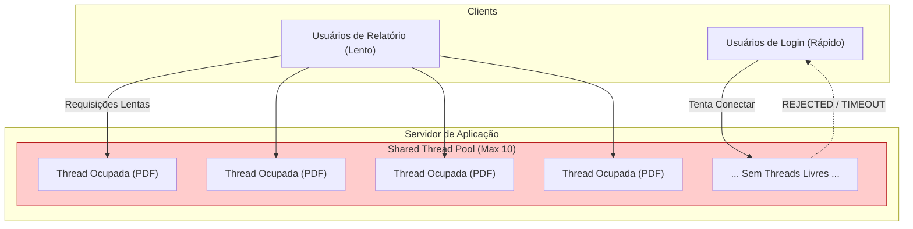
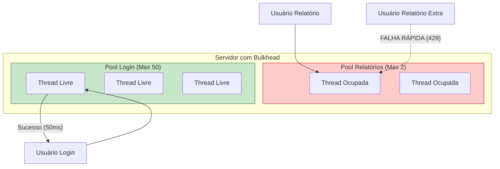
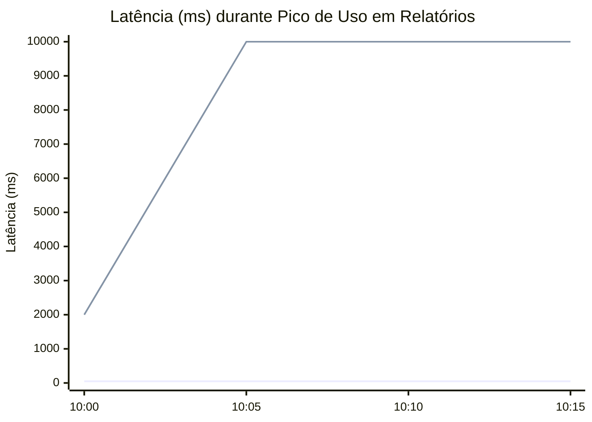
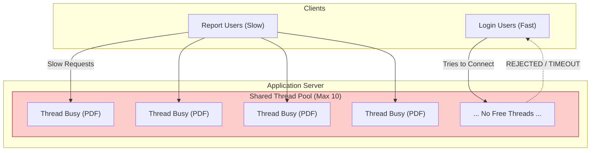
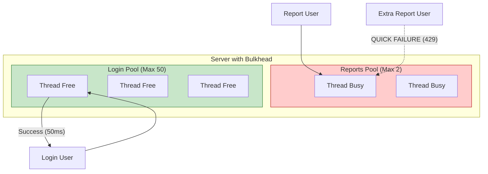
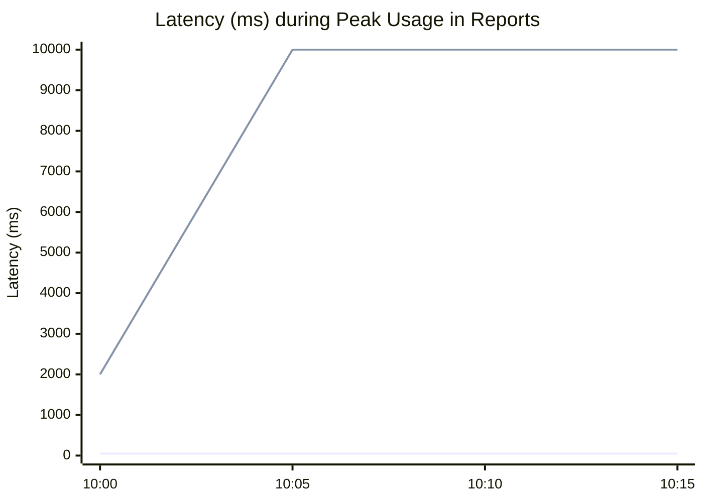

# O Padrão Bulkhead: Por que o Titanic afundou e sua API também vai

Como impedir que uma feature lenta derrube todo o seu sistema usando compartimentação de recursos

---

Imagine o cenário: é segunda-feira de manhã. Seu sistema tem uma funcionalidade crítica — o **Login** — que leva 50ms para responder. E tem uma funcionalidade secundária — **Exportar Relatório PDF** — que leva 10 segundos.

De repente, o departamento financeiro decide gerar todos os relatórios do mês.
Imediatamente, **ninguém mais consegue fazer login**. O suporte começa a receber chamados de "Sistema Fora do Ar".

Você olha os logs de erro do Login e não vê nada errado. O banco de dados está leve. A CPU está em 40%.
Por que o Login parou?

A resposta está na falta de isolamento de recursos. Você acabou de sofrer uma falha em cascata por esgotamento de *Thread Pool*. Hoje, vamos aprender a evitar isso com o padrão **Bulkhead**.

---

### O Problema: O Pool de Threads Compartilhado

Servidores de aplicação (Tomcat, Jetty, Undertow) ou frameworks reativos trabalham com um número finito de threads para processar requisições. Digamos que o padrão seja **200 threads**.

Numa arquitetura ingênua, todas as funcionalidades compartilham esse mesmo pool.

1.  Chegam 200 requisições simultâneas de "Gerar PDF".
2.  As 200 threads do Tomcat são alocadas para essas tarefas.
3.  Como gerar PDF é lento (I/O Bound ou CPU Bound), essas threads ficam presas por 10 segundos.
4.  Chega a requisição 201: Um usuário tentando fazer **Login**.
5.  **Resultado:** Não há threads disponíveis. A requisição de Login entra na fila (Queue) e eventualmente dá *Timeout*.

Uma feature não-crítica matou a feature mais crítica do sistema.

#### Visualizando o Desastre



---

### A Solução: O Padrão Bulkhead (Compartimentos Estanques)

O nome vem da engenharia naval. Navios são divididos em compartimentos selados (bulkheads). Se o casco for perfurado no setor de proa, a água enche apenas aquele setor. O resto do navio continua flutuando.

O Titanic afundou justamente porque seus *bulkheads* não iam até o teto; a água transbordou de um para o outro.

Em software, aplicamos isso **segregando os pools de recursos** para diferentes tipos de carga.

#### A Arquitetura Segregada

Ao invés de um pool único, criamos pools dedicados (ou semáforos) para cada serviço:

* **Pool A (Login):** 50 Threads.
* **Pool B (Relatórios):** 10 Threads.

Se 1.000 usuários tentarem gerar relatórios:
1.  As 10 threads do Pool B ficam ocupadas.
2.  A 11ª requisição de relatório é **rejeitada imediatamente** (`BulkheadFullException`).
3.  O Pool A (Login) continua 100% livre. O Login continua funcionando em 50ms.



---

### Implementação Prática com Resilience4j

No ecossistema Java/Spring Boot, a ferramenta padrão é o **Resilience4j**. Você pode configurar isso via anotação ou arquivo `yaml`.

#### Configuração (application.yml)

```yaml
resilience4j.bulkhead:
  instances:
    relatorioBackend:
      maxConcurrentCalls: 5  # Apenas 5 relatórios simultâneos
      maxWaitDuration: 0ms   # Não deixe esperando na fila, falhe logo!
    loginBackend:
      maxConcurrentCalls: 50
```

#### Uso no Código (Java)

```java
@Service
public class RelatorioService {

    @Bulkhead(name = "relatorioBackend", fallbackMethod = "fallbackRelatorio")
    public byte[] gerarPdfComplexo() {
        // Operação pesada de 10s
        return gerador.processar();
    }

    public byte[] fallbackRelatorio(BulkheadFullException ex) {
        // Retorna um erro amigável ou tenta mais tarde
        throw new ResponseStatusException(HttpStatus.TOO_MANY_REQUESTS, "Muitos relatórios sendo gerados. Tente em 1 min.");
    }
}
```

---

### Impacto na Performance e UX

Com o Bulkhead, mudamos o comportamento do sistema sob estresse. Em vez de degradar tudo para todos, degradamos **totalmente** uma funcionalidade para preservar as outras.

#### Gráfico de Latência sob Ataque

Imagine um ataque ou pico de uso na funcionalidade de Relatórios (Linha Vermelha) começando às 10:05.


* **Linha 1 (Login - Azul):** Mantém-se estável em 50ms, pois tem seu próprio pool protegido.
* **Linha 2 (Relatórios - Vermelha):** Satura e começa a rejeitar chamadas, mas não afeta a linha azul.

---

### Conclusão

O padrão Bulkhead é a diferença entre um sistema "frágil" (que quebra inteiro ao menor sinal de estresse) e um sistema "robusto" (que sacrifica funcionalidades não essenciais para manter o *Core Business* vivo).

Se você tem endpoints que variam muito em tempo de resposta e consumo de recursos (CPU/Memória), não deixe que eles nadem na mesma piscina de threads.

**Regra de Ouro:** Isole o que é crítico (Login, Checkout, Pagamento) do que é acessório (Relatórios, Histórico, Exportações). É melhor um usuário não conseguir baixar um PDF do que todos os usuários não conseguirem entrar no sistema.

---

## English Version

Imagine the scenario: It's Monday morning. Your system has a critical functionality — **Login** — that takes 50ms to respond. And it has a secondary functionality — **Export PDF Report** — that takes 10 seconds.

Suddenly, the finance department decides to generate all the month's reports.
Immediately, **no one can log in anymore**. Support starts receiving calls of "System Down".

You look at the Login error logs and see nothing wrong. The database is light. The CPU is at 40%.
Why did the Login stop?

The answer lies in the lack of resource isolation. You have just suffered a cascading failure due to *Thread Pool* exhaustion. Today, we will learn how to avoid this with the **Bulkhead** pattern.

---

### The Problem: The Shared Thread Pool

Application servers (Tomcat, Jetty, Undertow) or reactive frameworks work with a finite number of threads to process requests. Let's say the default is **200 threads**.

In a naive architecture, all functionalities share this same pool.

1.  200 simultaneous "Generate PDF" requests arrive.
2.  All 200 Tomcat threads are allocated to these tasks.
3.  Since generating PDF is slow (I/O Bound or CPU Bound), these threads are stuck for 10 seconds.
4.  Request 201 arrives: A user trying to **Login**.
5.  **Result:** There are no threads available. The Login request enters the Queue and eventually times out.

A non-critical feature killed the system's most critical feature.

#### Visualizing the Disaster



---

### The Solution: The Bulkhead Pattern

The name comes from naval engineering. Ships are divided into sealed compartments (bulkheads). If the hull is pierced in the bow sector, the water only fills that sector. The rest of the ship continues to float.

The Titanic sank precisely because its *bulkheads* did not reach the ceiling; the water overflowed from one to the other.

In software, we apply this by **segregating the resource pools** for different types of load.

#### The Segregated Architecture

Instead of a single pool, we create dedicated pools (or semaphores) for each service:

* **Pool A (Login):** 50 Threads.
* **Pool B (Reports):** 10 Threads.

If 1,000 users try to generate reports:
1.  The 10 threads in Pool B are occupied.
2.  The 11th report request is **rejected immediately** (`BulkheadFullException`).
3.  Pool A (Login) remains 100% free. Login continues to function in 50ms.



---

### Practical Implementation with Resilience4j

In the Java/Spring Boot ecosystem, the standard tool is **Resilience4j**. You can configure this via annotation or `yaml` file.

#### Configuration (application.yml)

```yaml
resilience4j.bulkhead:
  instances:
    relatorioBackend:
      maxConcurrentCalls: 5  # Only 5 simultaneous reports
      maxWaitDuration: 0ms   # Don't let it wait in the queue, fail quickly!
    loginBackend:
      maxConcurrentCalls: 50
```

#### Usage in Code (Java)

```java
@Service
public class RelatorioService {

    @Bulkhead(name = "relatorioBackend", fallbackMethod = "fallbackRelatorio")
    public byte[] gerarPdfComplexo() {
        // Heavy 10s operation
        return gerador.processar();
    }

    public byte[] fallbackRelatorio(BulkheadFullException ex) {
        // Returns a friendly error or tries again later
        throw new ResponseStatusException(HttpStatus.TOO_MANY_REQUESTS, "Too many reports being generated. Try again in 1 min.");
    }
}
```

---

### Impact on Performance and UX

With Bulkhead, we change the system's behavior under stress. Instead of degrading everything for everyone, we degrade **totally** one functionality to preserve the others.

#### Latency Chart under Attack

Imagine an attack or peak usage in the Reports functionality (Red Line) starting at 10:05.


* **Line 1 (Login - Blue):** Remains stable at 50ms, as it has its own protected pool.
* **Line 2 (Reports - Red):** Saturates and starts rejecting calls, but does not affect the blue line.

---

### Conclusion

The Bulkhead pattern is the difference between a "fragile" system (which breaks entirely at the slightest sign of stress) and a "robust" system (which sacrifices non-essential functionalities to keep the *Core Business* alive).

If you have endpoints that vary greatly in response time and resource consumption (CPU/Memory), don't let them swim in the same pool of threads.

**Golden Rule:** Isolate what is critical (Login, Checkout, Payment) from what is accessory (Reports, History, Exports). It is better for a user not to be able to download a PDF than for all users not to be able to log in to the system.


---

*This file is automatically generated and backed up from the blog system.*
*Last updated: 2025-12-06T22:25:05.254Z*
