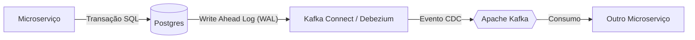
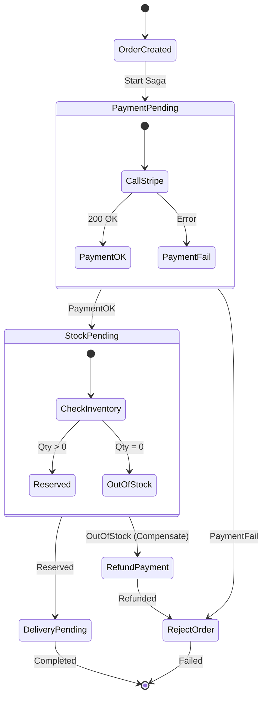

# O Pesadelo da Consistência Distribuída: O Guia Definitivo sobre Sagas, Outbox e Anomalias de Isolamento

Por que a sua arquitetura de microserviços está a corromper dados silenciosamente e como a engenharia de sistemas distribuídos resolve o impossível

---

Migrar de um Monólito para Microserviços é, na prática, uma "troca faustiana": você ganha escala organizacional e independência de deploy, mas entrega a sua alma, a segurança do **ACID** (Atomicidade, Consistência, Isolamento, Durabilidade), em troca da complexidade do **BASE** (Basically Available, Soft state, Eventual consistency).

A maioria das equipas descobre isto da pior maneira. Elas desenham o "Caminho Feliz" (Happy Path), onde o banco de dados, o Kafka e as APIs de terceiros funcionam perfeitamente. Mas a realidade da engenharia distribuída é feita de falhas parciais, *race conditions* e latência de rede.

Este artigo é um mergulho profundo nas trincheiras da consistência distribuída. Vamos dissecar o **Padrão Saga**, resolver o problema do **Dual Write** com CDC e mitigar a falta de **Isolamento** que causa prejuízos financeiros reais.

---

## 1. O Fim do `ROLLBACK`: A Matemática da Compensação

Num banco de dados relacional (RDBMS), o comando `ROLLBACK` é uma máquina do tempo: ele restaura o estado dos dados ao momento anterior ao início da transação, garantindo que "nada aconteceu".

Em sistemas distribuídos, **o tempo só anda para a frente**.
Se o Serviço A comitou uma alteração no seu banco e o Serviço B falhou 500ms depois, o banco do Serviço A **não pode** sofrer rollback técnico. A conexão já fechou. O dado já é visível para outros utilizadores.

A única solução é o **Rollback Semântico** (ou Transação de Compensação).
Para cada transação local $T_i$ que altera o estado, você deve projetar uma transação inversa $C_i$ que anula o efeito de negócio.

### A Anatomia de uma Saga
Uma Saga é uma sequência de transações locais.
Seja a Saga $S = T_1 \rightarrow T_2 \rightarrow T_3 \rightarrow ... \rightarrow T_n$.

* **Sucesso:** O sistema executa $T_1$ a $T_n$.
* **Falha (em $T_k$):** O sistema deve executar as compensações na ordem inversa: $C_{k-1} \rightarrow ... \rightarrow C_1$.

#### Tabela de Estratégia de Compensação

| Passo ($T_n$) | Ação ($T$) | Compensação ($C_n$) | Complexidade & Risco |
| :--- | :--- | :--- | :--- |
| **1. Pedido** | `Order.create(PENDING)` | `Order.reject(CANCELED)` | **Baixa:** Alteração de estado local. |
| **2. Pagamento** | `Stripe.charge($100)` | `Stripe.refund($100)` | **Média:** Dependência externa. O Refund pode falhar ou demorar dias. |
| **3. Stock** | `Inventory.reserve(ItemID)` | `Inventory.release(ItemID)` | **Alta:** Race conditions. Se o item foi libertado e reservado por outro utilizador, o release deve ser inteligente. |
| **4. Entrega** | `Shipping.label(Address)` | `Shipping.cancelLabel(ID)` | **Crítica:** Logística física. Se a etiqueta já foi impressa, o cancelamento lógico não para o camião. |

> **O Conceito de "Pivot Transaction":**
> Em toda Saga, existe um ponto de "não retorno", chamado Pivot Transaction.
> * Tudo **antes** do Pivot pode ser compensado sem efeitos colaterais graves.
> * Tudo **depois** do Pivot deve ser garantido que terá sucesso ("Retriable").
> * O Pivot geralmente é a ação externa mais difícil de reverter (ex: Cobrar o cartão ou Imprimir a etiqueta).

---

## 2. O Problema do "Dual Write" (Escrita Dupla)

Este é o erro arquitetural mais comum em sistemas que introduzem Kafka ou RabbitMQ.
Considere o código ingénuo de um Orquestrador:

```javascript
// A ARMADILHA DO DUAL WRITE
async function createOrder(order) {
    // Passo 1: Persistência
    await db.query("INSERT INTO orders ..."); 
    
    // Passo 2: Comunicação
    // SE O SERVIDOR CRASHAR AQUI, OU O KAFKA DER TIMEOUT:
    // O pedido existe no banco, mas o resto do sistema nunca saberá.
    // Resultado: Inconsistência de Dados (Data Corruption).
    await kafka.send("OrderCreated", order);
}
```

Você não pode garantir atomicidade entre dois recursos de infraestrutura diferentes (Postgres e Kafka) sem usar 2PC (Two-Phase Commit), que é lento e frequentemente não suportado.

### A Solução: Transactional Outbox Pattern

A ideia é simples: use o banco de dados como uma fila de mensagens temporária para garantir atomicidade.

1.  **Na Transação de Negócio:**
    Insira o pedido na tabela `Orders` E o evento na tabela `Outbox` dentro da **mesma** transação SQL `BEGIN...COMMIT`.
    O banco garante: ou ambos são gravados, ou nenhum.

2.  **O Processo de Relay (Transporte):**
    Um processo assíncrono lê a tabela `Outbox` e publica no Kafka. Se este processo falhar, ele tenta de novo. Isso garante entrega *At-Least-Once*.

#### Implementação Real: Polling vs. Tailing (CDC)

* **Abordagem Amadora (Polling Publisher):**
    Um Cron Job roda `SELECT * FROM outbox WHERE sent = false` a cada segundo.
    * *Problema:* Latência e carga desnecessária no banco. Não escala bem.

* **Abordagem Enterprise (Log Tailing / CDC):**
    Usamos ferramentas de **Change Data Capture** como o **Debezium**.
    O Debezium conecta-se diretamente ao **Transaction Log** do banco de dados (WAL no Postgres, Binlog no MySQL). Assim que o `COMMIT` acontece no banco, o Debezium deteta a mudança no log e empurra o evento para o Kafka em milissegundos.
    * *Vantagem:* Zero impacto de query no banco, latência mínima e desacoplamento total.



---

## 3. Orquestração vs. Coreografia: A Decisão de Arquitetura

Como os seus serviços conversam? A escolha define a manutenção do sistema a longo prazo.

### Coreografia (Event-Driven)
Não existe chefe. Os serviços reagem a eventos.
* `Order Service` emite `OrderCreated`.
* `Payment Service` ouve, cobra e emite `PaymentProcessed`.
* `Stock Service` ouve, reserva e emite `StockReserved`.

* **Onde brilha:** Fluxos simples, lineares, com 2-3 serviços.
* **Onde morre:** Quando o fluxo tem condicionais complexas ("Se o valor > 1000 e o user for VIP..."). Torna-se um "Espaguete de Eventos". Ninguém consegue olhar para o código e entender o fluxo de negócio completo.

### Orquestração (State Machine)
Um serviço central (Orquestrador) comanda explicitamente.
* `Orquestrador` chama `Payment.charge()`. Aguarda resposta.
* Se sucesso, chama `Stock.reserve()`.
* Se falha, chama `Payment.refund()`.

O Orquestrador deve ser implementado como uma **Máquina de Estados Persistente**.
Isso significa que o estado da Saga (`WAITING_PAYMENT`, `COMPENSATING_STOCK`) é salvo no banco.



---

## 4. O "I" Esquecido do ACID: Anomalias de Isolamento

Este é o tópico mais avançado e perigoso. Sagas **não têm isolamento**.
Como as transações locais comitam imediatamente, os dados intermediários ficam visíveis para o mundo. Isso causa anomalias graves.

### Anomalia 1: Leitura Suja (Dirty Read)
1.  **Saga A:** Reserva o último item do stock. (Stock = 0).
2.  **Saga B:** Tenta comprar. Vê Stock = 0. Falha e notifica o cliente "Esgotado".
3.  **Saga A:** Falha no pagamento 10 segundos depois. Compensa e devolve o item. (Stock = 1).
**Resultado:** A Saga B perdeu uma venda legítima baseada num dado que foi revertido.

### Anomalia 2: Atualização Perdida (Lost Update)
1.  **Saga A:** Lê o pedido e começa a editar.
2.  **Saga B:** Lê o mesmo pedido e começa a editar (ex: cancelamento pelo suporte).
3.  **Saga A:** Escreve as suas mudanças.
4.  **Saga B:** Escreve as suas mudanças, **sobrescrevendo** o que a Saga A fez, sem saber.

### A Solução: Semantic Locking (Bloqueio Semântico)

Não podemos usar locks de banco de dados (`SELECT FOR UPDATE`) entre microserviços. Precisamos de locks ao nível da aplicação.

**Estratégia do Estado Pendente (`_PENDING`)**
Nunca altere o valor real (`stock_qty`) diretamente durante uma Saga.
Em vez disso, mova o dado para um estado "Em Reserva".

* Em vez de `UPDATE products SET qty = qty - 1`
* Faça `INSERT INTO product_reservations (order_id, status) VALUES (123, 'PENDING')`

A query de leitura de stock muda para:
`Available = TotalQty - Count(Reservations WHERE status = 'PENDING' OR 'CONFIRMED')`

Isso permite que outras Sagas saibam que:
1.  O stock está "tomado" temporariamente.
2.  Mas a transação ainda não finalizou.
Isso dá flexibilidade para implementar lógicas como "Backorder" ou "Notify Me When Available".

---

## 5. Implementação no Mundo Real: O que usar?

Não escreva o seu próprio framework de Sagas. A gestão de estado, *retries* exponenciais, timeouts e recuperação de falhas (crash recovery) é extremamente difícil de fazer corretamente.

### Stack Recomendada para 2024/2025:

1.  **Temporal.io (ou Cadence):**
    A tecnologia mais robusta atualmente. Permite escrever Sagas como código imperativo simples (em Go, Java, TS). O servidor Temporal persiste o histórico de execução. Se o seu microsserviço cair na linha 50, o Temporal restaura o estado e continua na linha 50 noutra máquina. É "Durability-as-Code".

2.  **MassTransit (Ecossistema .NET):**
    O padrão ouro para C#. Possui uma implementação incrível de *Routing Slip* e State Machines em cima do RabbitMQ.

3.  **Bancos de Dados com suporte a Streams:**
    Se não quiser usar Kafka, bancos como **DynamoDB Streams** ou **Redis Streams** podem servir como base para o Outbox Pattern de forma mais leve.

### Conclusão

Sagas não são apenas um padrão de design; são uma mudança de mentalidade.
Você deixa de programar esperando que o banco de dados garanta a verdade, e passa a programar assumindo que **o estado é fluido, a falha é inevitável e a consistência é apenas eventual.**

Se o seu sistema financeiro ou de inventário está a perder dados, pare de procurar bugs no código de lógica. Procure bugs na arquitetura de transações.

---

## English Version

Migrating from a Monolith to Microservices is, in practice, a "Faustian bargain": you gain organizational scale and deployment independence, but you surrender your soul, the security of **ACID** (Atomicity, Consistency, Isolation, Durability), in exchange for the complexity of **BASE** (Basically Available, Soft state, Eventual consistency).

Most teams discover this the hard way. They design the "Happy Path," where the database, Kafka, and third-party APIs work perfectly. But the reality of distributed engineering is made of partial failures, race conditions, and network latency.

This article is a deep dive into the trenches of distributed consistency. We will dissect the **Saga Pattern**, solve the **Dual Write** problem with CDC, and mitigate the lack of **Isolation** that causes real financial losses.

---

## 1. The End of `ROLLBACK`: The Mathematics of Compensation

In a relational database (RDBMS), the `ROLLBACK` command is a time machine: it restores the state of the data to the moment before the transaction started, ensuring that "nothing happened."

In distributed systems, **time only moves forward**.
If Service A committed a change to its database and Service B failed 500ms later, Service A's database **cannot** be technically rolled back. The connection is already closed. The data is already visible to other users.

The only solution is **Semantic Rollback** (or Compensation Transaction).
For each local transaction $T_i$ that alters the state, you must design an inverse transaction $C_i$ that undoes the business effect.

### The Anatomy of a Saga
A Saga is a sequence of local transactions.
Let the Saga be $S = T_1 \rightarrow T_2 \rightarrow T_3 \rightarrow ... \rightarrow T_n$.

* **Success:** The system executes $T_1$ to $T_n$.
* **Failure (at $T_k$):** The system must execute the compensations in reverse order: $C_{k-1} \rightarrow ... \rightarrow C_1$.

#### Compensation Strategy Table

| Step ($T_n$) | Action ($T$) | Compensation ($C_n$) | Complexity & Risk |
| :--- | :--- | :--- | :--- |
| **1. Order** | `Order.create(PENDING)` | `Order.reject(CANCELED)` | **Low:** Local state change. |
| **2. Payment** | `Stripe.charge($100)` | `Stripe.refund($100)` | **Medium:** External dependency. The Refund may fail or take days. |
| **3. Stock** | `Inventory.reserve(ItemID)` | `Inventory.release(ItemID)` | **High:** Race conditions. If the item was released and reserved by another user, the release must be intelligent. |
| **4. Delivery** | `Shipping.label(Address)` | `Shipping.cancelLabel(ID)` | **Critical:** Physical logistics. If the label has already been printed, the logical cancellation does not stop the truck. |

> **The Concept of "Pivot Transaction":**
> In every Saga, there is a point of "no return," called the Pivot Transaction.
> * Everything **before** the Pivot can be compensated without serious side effects.
> * Everything **after** the Pivot must be guaranteed to succeed ("Retriable").
> * The Pivot is usually the most difficult external action to reverse (e.g., Charging the card or Printing the label).

---

## 2. The "Dual Write" Problem

This is the most common architectural mistake in systems that introduce Kafka or RabbitMQ.
Consider the naive code of an Orchestrator:

```javascript
// THE DUAL WRITE TRAP
async function createOrder(order) {
    // Step 1: Persistence
    await db.query("INSERT INTO orders ..."); 
    
    // Step 2: Communication
    // IF THE SERVER CRASHES HERE, OR KAFKA TIMES OUT:
    // The order exists in the database, but the rest of the system will never know.
    // Result: Data Inconsistency (Data Corruption).
    await kafka.send("OrderCreated", order);
}
```

You cannot guarantee atomicity between two different infrastructure resources (Postgres and Kafka) without using 2PC (Two-Phase Commit), which is slow and often not supported.

### The Solution: Transactional Outbox Pattern

The idea is simple: use the database as a temporary message queue to ensure atomicity.

1.  **In the Business Transaction:**
    Insert the order into the `Orders` table AND the event into the `Outbox` table within the **same** SQL transaction `BEGIN...COMMIT`.
    The database guarantees: either both are written, or neither.

2.  **The Relay Process (Transport):**
    An asynchronous process reads the `Outbox` table and publishes to Kafka. If this process fails, it tries again. This guarantees *At-Least-Once* delivery.

#### Real Implementation: Polling vs. Tailing (CDC)

* **Amateur Approach (Polling Publisher):**
    A Cron Job runs `SELECT * FROM outbox WHERE sent = false` every second.
    * *Problem:* Latency and unnecessary load on the database. Does not scale well.

* **Enterprise Approach (Log Tailing / CDC):**
    We use **Change Data Capture** tools like **Debezium**.
    Debezium connects directly to the database's **Transaction Log** (WAL in Postgres, Binlog in MySQL). As soon as the `COMMIT` happens in the database, Debezium detects the change in the log and pushes the event to Kafka in milliseconds.
    * *Advantage:* Zero query impact on the database, minimal latency, and total decoupling.


---

## 3. Orchestration vs. Choreography: The Architecture Decision

How do your services communicate? The choice defines the system's maintainability in the long term.

### Choreography (Event-Driven)
There is no boss. Services react to events.
* `Order Service` emits `OrderCreated`.
* `Payment Service` listens, charges, and emits `PaymentProcessed`.
* `Stock Service` listens, reserves, and emits `StockReserved`.

* **Where it shines:** Simple, linear flows, with 2-3 services.
* **Where it dies:** When the flow has complex conditionals ("If the value > 1000 and the user is VIP..."). It becomes an "Event Spaghetti." No one can look at the code and understand the complete business flow.

### Orchestration (State Machine)
A central service (Orchestrator) commands explicitly.
* `Orchestrator` calls `Payment.charge()`. Waits for a response.
* If successful, calls `Stock.reserve()`.
* If it fails, calls `Payment.refund()`.

The Orchestrator must be implemented as a **Persistent State Machine**.
This means that the Saga's state (`WAITING_PAYMENT`, `COMPENSATING_STOCK`) is saved in the database.


---

## 4. The Forgotten "I" of ACID: Isolation Anomalies

This is the most advanced and dangerous topic. Sagas **do not have isolation**.
Since local transactions commit immediately, intermediate data becomes visible to the world. This causes serious anomalies.

### Anomaly 1: Dirty Read
1.  **Saga A:** Reserves the last item in stock. (Stock = 0).
2.  **Saga B:** Tries to buy. Sees Stock = 0. Fails and notifies the customer "Out of Stock."
3.  **Saga A:** Fails in payment 10 seconds later. Compensates and returns the item. (Stock = 1).
**Result:** Saga B lost a legitimate sale based on data that was rolled back.

### Anomaly 2: Lost Update
1.  **Saga A:** Reads the order and starts editing.
2.  **Saga B:** Reads the same order and starts editing (e.g., cancellation by support).
3.  **Saga A:** Writes its changes.
4.  **Saga B:** Writes its changes, **overwriting** what Saga A did, without knowing.

### The Solution: Semantic Locking

We cannot use database locks (`SELECT FOR UPDATE`) between microservices. We need locks at the application level.

**Pending State Strategy (`_PENDING`)**
Never change the actual value (`stock_qty`) directly during a Saga.
Instead, move the data to a "Reserved" state.

* Instead of `UPDATE products SET qty = qty - 1`
* Do `INSERT INTO product_reservations (order_id, status) VALUES (123, 'PENDING')`

The stock read query changes to:
`Available = TotalQty - Count(Reservations WHERE status = 'PENDING' OR 'CONFIRMED')`

This allows other Sagas to know that:
1.  The stock is temporarily "taken."
2.  But the transaction has not yet finalized.
This gives flexibility to implement logics like "Backorder" or "Notify Me When Available."

---

## 5. Real-World Implementation: What to Use?

Don't write your own Saga framework. State management, exponential retries, timeouts, and crash recovery are extremely difficult to do correctly.

### Recommended Stack for 2024/2025:

1.  **Temporal.io (or Cadence):**
    The most robust technology currently. It allows you to write Sagas as simple imperative code (in Go, Java, TS). The Temporal server persists the execution history. If your microservice crashes on line 50, Temporal restores the state and continues on line 50 on another machine. It's "Durability-as-Code."

2.  **MassTransit (.NET Ecosystem):**
    The gold standard for C#. It has an incredible implementation of *Routing Slip* and State Machines on top of RabbitMQ.

3.  **Databases with Streaming Support:**
    If you don't want to use Kafka, databases like **DynamoDB Streams** or **Redis Streams** can serve as a lighter basis for the Outbox Pattern.

### Conclusion

Sagas are not just a design pattern; they are a change in mindset.
You stop programming expecting the database to guarantee the truth, and you start programming assuming that **state is fluid, failure is inevitable, and consistency is only eventual.**

If your financial or inventory system is losing data, stop looking for bugs in the logic code. Look for bugs in the transaction architecture.


---

*This file is automatically generated and backed up from the blog system.*
*Last updated: 2025-12-27T13:35:04.493Z*
