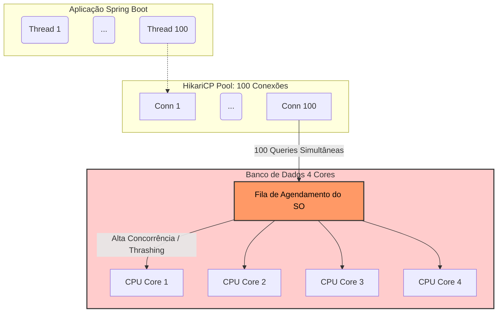
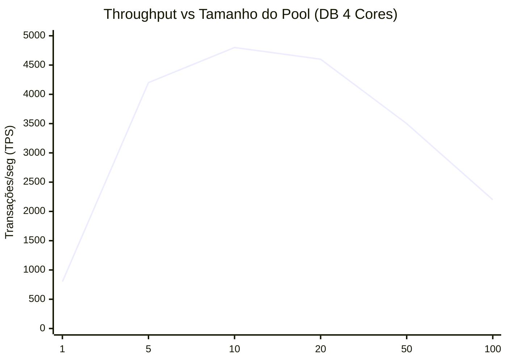
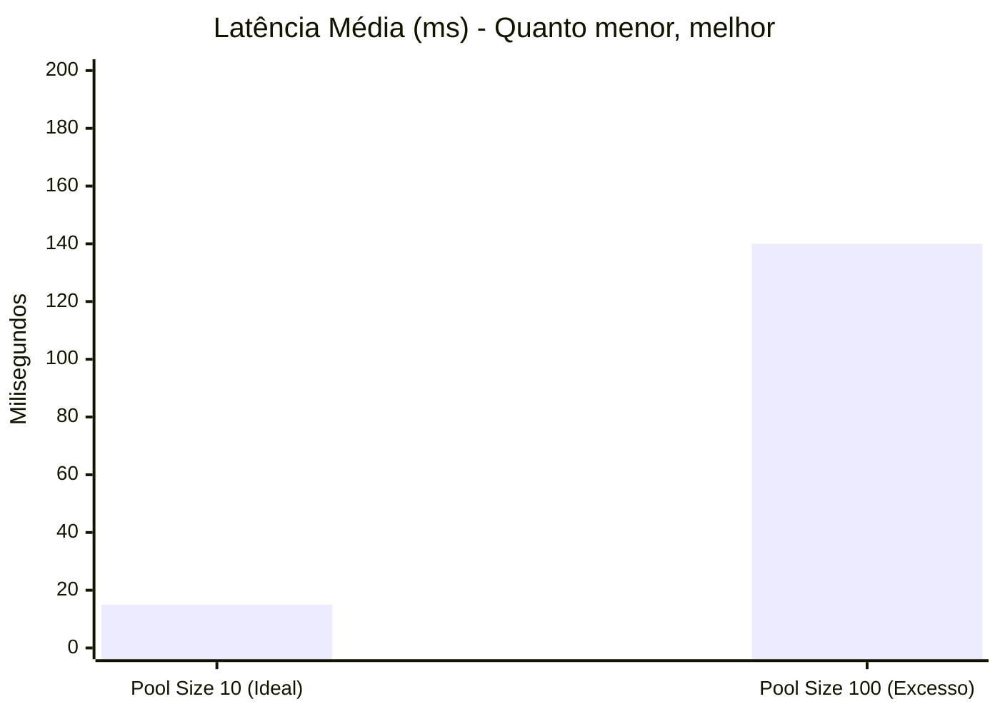
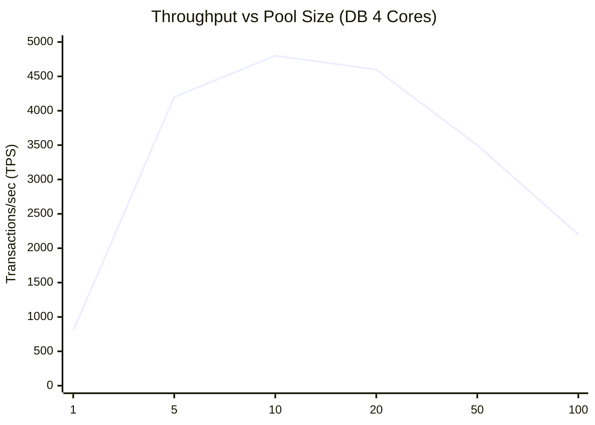
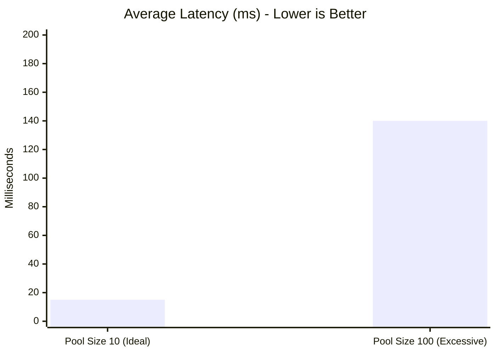

# Pare de Aumentar o Pool de Conexões

Por que "Mais" pode significar "Lento" no HikariCP e como encontrar o número mágico

---

Quando sua aplicação começa a lançar `SQLTransientConnectionException: Connection is not available, request timed out`, o instinto natural de 90% dos desenvolvedores é ir ao `application.properties` e fazer isto:

```properties
# O "band-aid" clássico que piora a ferida
spring.datasource.hikari.maximum-pool-size=100
```

Se 10 conexões estavam engargalando, 100 devem resolver, certo? **Errado.**

Na maioria dos casos de alta concorrência, aumentar o pool de conexões além de um limite calculado matematicamente não apenas *não resolve* o problema, como diminui o *throughput* da sua aplicação e aumenta a latência latente.

Neste artigo, vamos entender a física por trás do pool de conexões, o custo oculto do *Context Switching* e qual é a "Fórmula Mágica" para dimensionar seu pool no Spring Boot.

---

### O Mito: "Mais conexões = Mais processamento paralelo"

É intuitivo pensar no banco de dados como um armazém: quanto mais portas abertas (conexões), mais pessoas (threads) entram e saem.

Porém, computadores não funcionam assim. O banco de dados (seja PostgreSQL, MySQL ou Oracle) é limitado pelo número de **Cores de CPU** disponíveis para processar as queries ativas.

Se você tem um servidor de banco de dados com **4 Cores** e configura um pool de **100 conexões**:
1.  Você permite que 100 queries tentem rodar "simultaneamente".
2.  A CPU só consegue processar 4 de cada vez (uma por Core).
3.  As outras 96 entram numa fila de espera.
4.  O Sistema Operacional precisa pausar uma thread, salvar o estado, carregar outra, processar um pouco, pausar de novo...

Esse processo se chama **Context Switching**. E ele custa caro para a CPU.

#### O Custo do Context Switching

Imagine que você está escrevendo código (CPU processando). A cada 10 segundos, um Gerente de Projeto te interrompe (Context Switch) para perguntar sobre um ticket diferente. Você passa mais tempo tentando lembrar onde parou do que codando efetivamente.

Isso é exatamente o que acontece com seu banco de dados quando o pool é grande demais: ele gasta mais CPU trocando de tarefa do que executando SQL.

---

### Visualizando o Gargalo

Vamos ver como o fluxo se comporta em um cenário de superalocação (*oversubscription*).



*Resultado:* A CPU do banco entra em *thrashing*, a latência sobe e o throughput cai.

---

### A Matemática do Tuning: Menos é Mais

O time do PostgreSQL e o criador do HikariCP (Brett Wooldridge) sugerem uma fórmula base para definir o tamanho máximo do pool. A fórmula considera que o disco (SSD) não é mais o gargalo principal, e sim a CPU.

$$
TamanhoPool = (TotalCores \times 2) + SpindleCount
$$

* **TotalCores:** Número de CPUs lógicas do servidor de banco de dados.
* **SpindleCount:** Número de discos (geralmente ignorado em Cloud/SSD, considerado 0 ou 1).

**Exemplo Prático:**
Se seu RDS tem **4 vCPUs**:
Pool Ideal = $(4 \times 2) + 1 = 9$.

Sim, **9 conexões**. Arredonde para 10. Configurar 50 ou 100 conexões para um banco de 4 CPUs é desperdício de recurso.

---

### Estudo de Caso: Performance Real

Vamos simular um benchmark de uma API Spring Boot simples (`findUserById`) bombardeada por 500 usuários simultâneos.

**Ambiente:**
* DB: 4 vCPUs.
* App: Spring Boot + HikariCP.
* Carga: 500 Requests Concorrentes.

#### 1. Throughput (Transações por Segundo)

Neste gráfico, vemos o comportamento do sistema variando o tamanho do pool de 1 até 100.



**Análise:**
* **Pool 1 a 5:** Crescimento linear. Adicionar conexões ajuda.
* **Pool 10 (O Ponto Doce):** Máximo throughput. A CPU está saturada com trabalho útil.
* **Pool 50 a 100:** O throughput **cai drasticamente**. O overhead supera o ganho.

#### 2. Latência (Tempo de Resposta - 95th Percentile)

O impacto na latência é ainda pior. Com muitas conexões, algumas requisições "ganham na loteria" e pegam a CPU, outras ficam presas na fila do agendador do SO.



---

### Como Configurar Corretamente no Spring Boot

Agora que você sabe que aumentar o pool indiscriminadamente é um erro, aqui está o checklist para configurar o HikariCP para máxima eficiência:

#### 1. Descubra seus Cores
Verifique quantos vCPUs seu banco de dados possui. Vamos assumir **4 vCPUs**.

#### 2. Configure o `maximum-pool-size`
Use a fórmula: `Cores * 2`.

```properties
# application.properties
spring.datasource.hikari.maximum-pool-size=10
```

#### 3. Elimine o redimensionamento dinâmico
Muitos tutoriais recomendam um `minimum-idle` baixo para "economizar recursos". No HikariCP, a recomendação é **fixar o tamanho do pool**. Se você quer performance de ponta, não quer pagar o custo de *handshake* (abertura de conexão SSL/TCP) no meio de um pico de tráfego.

```properties
# Mantenha igual ao maximo. O pool fica sempre "quente" e pronto.
spring.datasource.hikari.minimum-idle=10
```

#### 4. Ajuste o Timeout
Se todas as 10 conexões estiverem ocupadas, a 11ª requisição vai esperar. O padrão é 30 segundos. Isso é uma eternidade para uma API REST. Falhe rápido para liberar a thread do servidor web.

```properties
# Se não conseguir uma conexão em 2 segundos, lance erro.
spring.datasource.hikari.connection-timeout=2000
```

---

### Conclusão

A intuição de "quanto mais, melhor" não se aplica a pools de conexão. O limite de velocidade não é o tamanho do pool configurado na aplicação, é a física da CPU do seu banco de dados.

Um pool pequeno e bem dimensionado (fixo no tamanho ótimo) resulta em:
1.  **Menor Latência:** Queries não disputam atenção da CPU.
2.  **Maior Throughput:** Menos tempo gasto em Context Switching.
3.  **Estabilidade:** O banco não trava sob carga extrema; o gargalo é controlado na aplicação (na fila do pool).

Na próxima vez que ver um timeout de conexão, antes de aumentar o pool para 100, verifique se suas queries estão lentas (faltando índice?) ou se você precisa escalar verticalmente (mais CPU) o seu banco. Aumentar o pool só vai esconder a poeira debaixo do tapete — e criar uma montanha que vai te fazer tropeçar depois.

---

## English Version

When your application starts throwing `SQLTransientConnectionException: Connection is not available, request timed out`, the natural instinct for 90% of developers is to go to `application.properties` and do this:

```properties
# The classic "band-aid" that makes the wound worse
spring.datasource.hikari.maximum-pool-size=100
```

If 10 connections were bottlenecking, 100 should solve it, right? **Wrong.**

In most high-concurrency scenarios, increasing the connection pool beyond a mathematically calculated limit not only *doesn't solve* the problem but also decreases your application's *throughput* and increases latent latency.

In this article, we'll understand the physics behind connection pooling, the hidden cost of *Context Switching*, and what the "Magic Formula" is for sizing your pool in Spring Boot.

---

### The Myth: "More connections = More parallel processing"

It's intuitive to think of the database as a warehouse: the more open doors (connections), the more people (threads) can go in and out.

However, computers don't work that way. The database (whether PostgreSQL, MySQL, or Oracle) is limited by the number of **CPU Cores** available to process active queries.

If you have a database server with **4 Cores** and configure a pool of **100 connections**:
1. You allow 100 queries to try to run "simultaneously."
2. The CPU can only process 4 at a time (one per Core).
3. The other 96 enter a waiting queue.
4. The Operating System needs to pause one thread, save its state, load another, process a bit, pause again...

This process is called **Context Switching**. And it's expensive for the CPU.

#### The Cost of Context Switching

Imagine you're writing code (CPU processing). Every 10 seconds, a Project Manager interrupts you (Context Switch) to ask about a different ticket. You spend more time trying to remember where you left off than effectively coding.

This is exactly what happens to your database when the pool is too large: it spends more CPU switching tasks than executing SQL.

---

### Visualizing the Bottleneck

Let's see how the flow behaves in an oversubscription scenario.


*Result:* The database CPU trashes, latency rises, and throughput drops.

---

### The Math of Tuning: Less is More

The PostgreSQL team and the creator of HikariCP (Brett Wooldridge) suggest a basic formula for defining the maximum pool size. The formula considers that disk (SSD) is no longer the main bottleneck, but rather the CPU.

$$
PoolSize = (TotalCores \times 2) + SpindleCount
$$

*   **TotalCores:** Number of logical CPUs of the database server.
*   **SpindleCount:** Number of disks (usually ignored in Cloud/SSD, considered 0 or 1).

**Practical Example:**
If your RDS has **4 vCPUs**:
Ideal Pool = $(4 \times 2) + 1 = 9$.

Yes, **9 connections**. Round up to 10. Configuring 50 or 100 connections for a 4-CPU database is a waste of resources.

---

### Case Study: Real Performance

Let's simulate a benchmark of a simple Spring Boot API (`findUserById`) bombarded by 500 concurrent users.

**Environment:**
*   DB: 4 vCPUs.
*   App: Spring Boot + HikariCP.
*   Load: 500 Concurrent Requests.

#### 1. Throughput (Transactions per Second)

In this graph, we see the system's behavior by varying the pool size from 1 to 100.



**Analysis:**
*   **Pool 1 to 5:** Linear growth. Adding connections helps.
*   **Pool 10 (The Sweet Spot):** Maximum throughput. The CPU is saturated with useful work.
*   **Pool 50 to 100:** Throughput **drops drastically**. The overhead outweighs the gain.

#### 2. Latency (Response Time - 95th Percentile)

The impact on latency is even worse. With many connections, some requests "win the lottery" and get the CPU, others get stuck in the OS scheduler queue.



---

### How to Configure Correctly in Spring Boot

Now that you know that indiscriminately increasing the pool is a mistake, here's the checklist to configure HikariCP for maximum efficiency:

#### 1. Discover your Cores
Check how many vCPUs your database has. Let's assume **4 vCPUs**.

#### 2. Configure `maximum-pool-size`
Use the formula: `Cores * 2`.

```properties
# application.properties
spring.datasource.hikari.maximum-pool-size=10
```

#### 3. Eliminate dynamic resizing
Many tutorials recommend a low `minimum-idle` to "save resources." In HikariCP, the recommendation is to **fix the pool size**. If you want top performance, you don't want to pay the cost of a handshake (SSL/TCP connection opening) in the middle of a traffic peak.

```properties
# Keep it equal to max. The pool is always "warm" and ready.
spring.datasource.hikari.minimum-idle=10
```

#### 4. Adjust Timeout
If all 10 connections are busy, the 11th request will wait. The default is 30 seconds. That's an eternity for a REST API. Fail fast to free up the web server thread.

```properties
# If a connection can't be obtained in 2 seconds, throw an error.
spring.datasource.hikari.connection-timeout=2000
```

---

### Conclusion

The intuition of "the more, the merrier" does not apply to connection pools. The speed limit is not the pool size configured in the application; it's the physics of your database's CPU.

A small, well-sized pool (fixed at the optimal size) results in:
1.  **Lower Latency:** Queries don't contend for CPU attention.
2.  **Higher Throughput:** Less time spent in Context Switching.
3.  **Stability:** The database doesn't crash under extreme load; the bottleneck is controlled at the application level (in the pool queue).

Next time you see a connection timeout, before increasing the pool to 100, check if your queries are slow (missing an index?) or if you need to vertically scale (more CPU) your database. Increasing the pool will only sweep dust under the rug — and create a mountain that will trip you up later.

---

*This file is automatically generated and backed up from the blog system.*
*Last updated: 2025-12-04T05:01:58.271Z*
