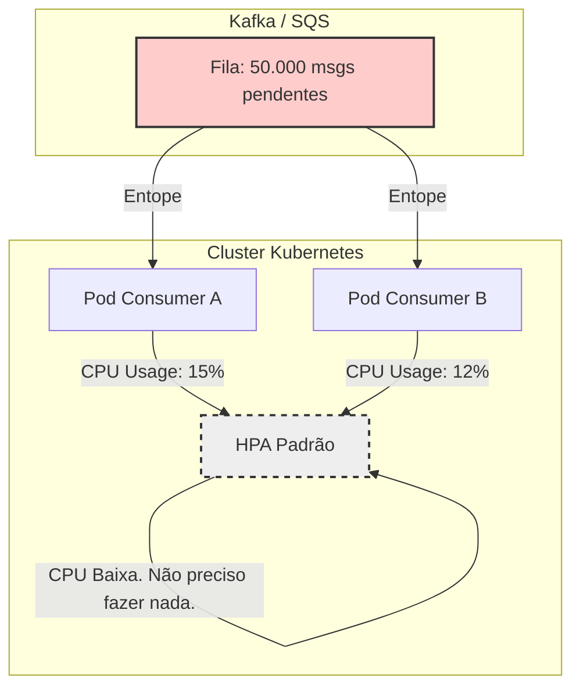
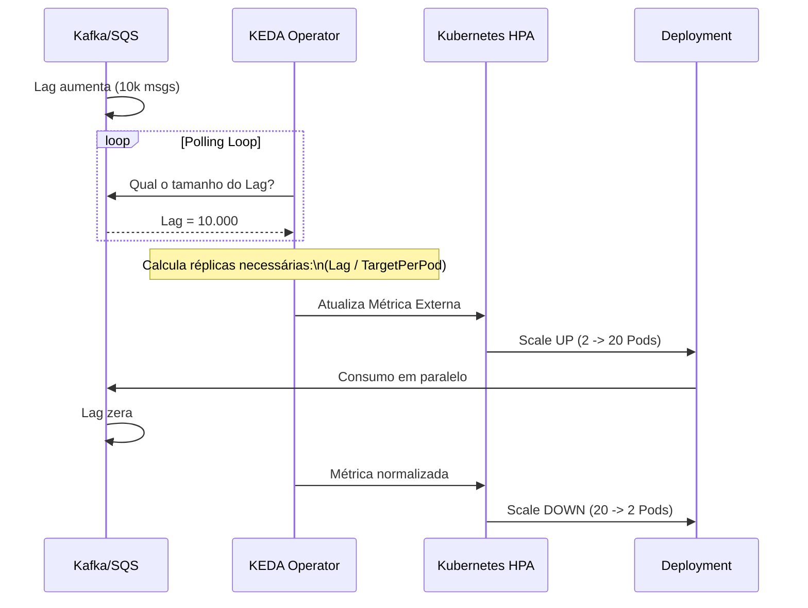
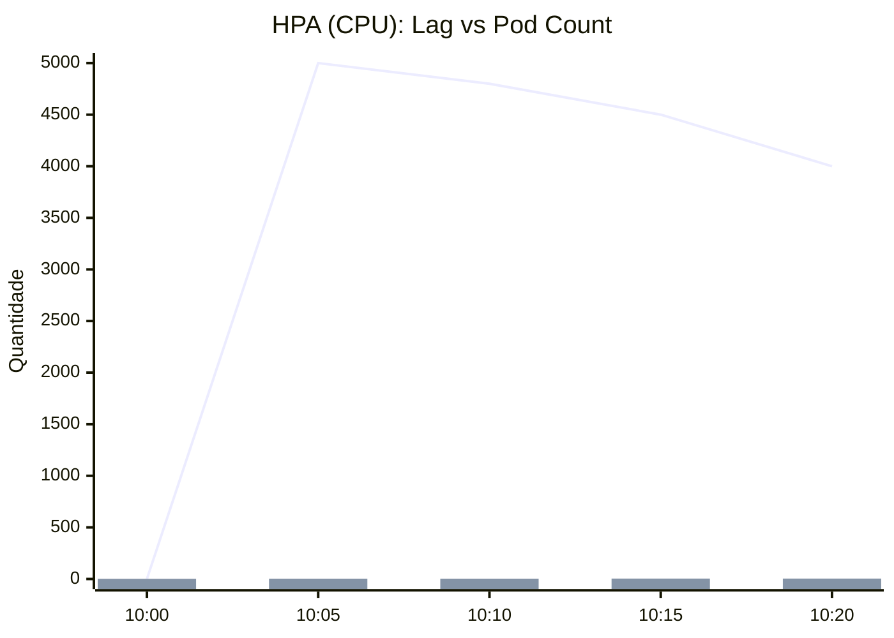
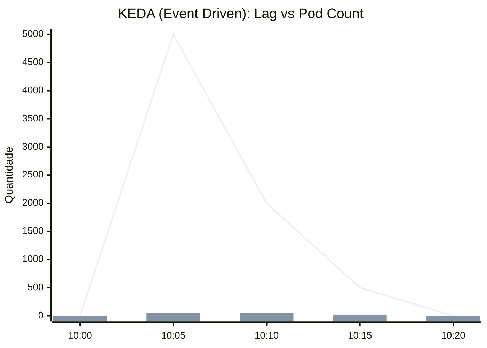
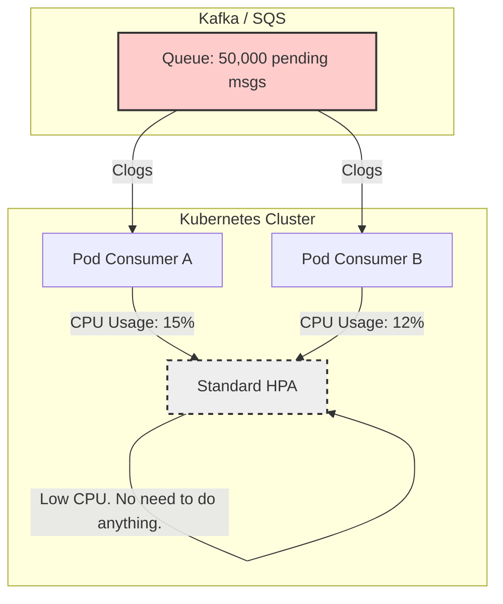
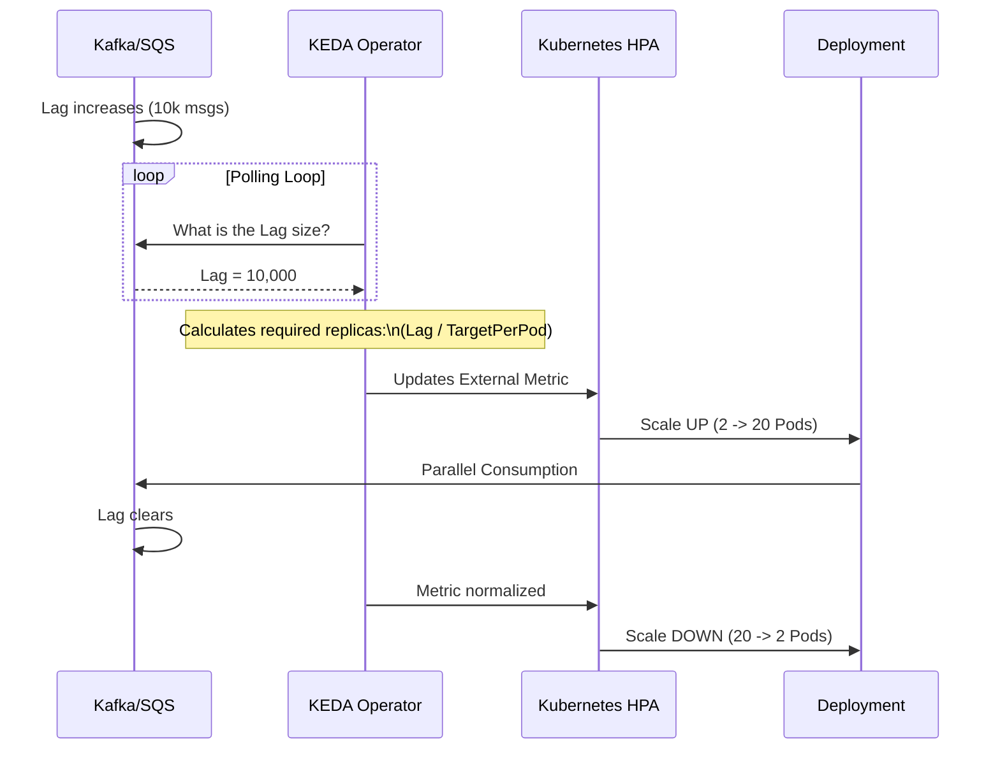
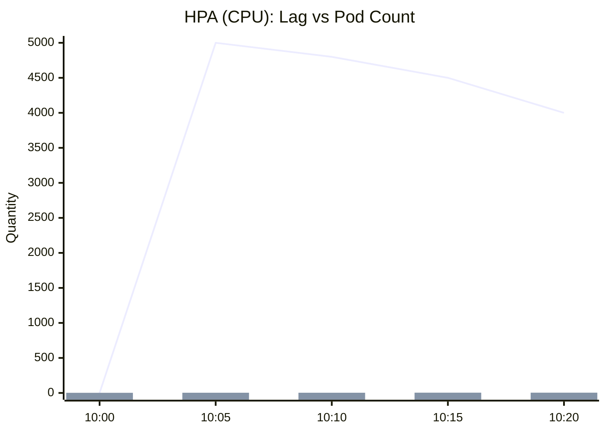

# Pare de Escalar seus Consumers por CPU

Por que o HPA nativo do Kubernetes está matando sua arquitetura de eventos e como o KEDA resolve isso

---

Você desenhou uma arquitetura de microsserviços orientada a eventos (EDA) perfeita. Usou Kafka (ou RabbitMQ/SQS), separou produtores de consumidores e deployou tudo no Kubernetes.

Tudo funciona bem, até o dia da Black Friday. A fila de pedidos explode para 500 mil mensagens acumuladas (Lag). Você corre para o dashboard do Grafana e vê que seus Pods consumidores... **não estão escalando.**

Eles continuam lá, fixos em 2 réplicas, enquanto o negócio perde dinheiro. Ao olhar o uso de CPU, você vê míseros 10%.

**O que aconteceu?** Você caiu na armadilha clássica de tentar escalar workloads assíncronos usando métricas de workloads síncronos (CPU/RAM).

Neste artigo, vamos entender por que o HPA (Horizontal Pod Autoscaler) padrão é "cego" para filas e como o **KEDA (Kubernetes Event-driven Autoscaling)** é a peça que falta na sua infraestrutura.

---

### O Problema: CPU não é Proxy para Trabalho Assíncrono

O HPA nativo do Kubernetes foi desenhado pensando primariamente em APIs REST stateless. Se uma API recebe muitos requests, ela processa mais, a CPU sobe, o HPA detecta e escala. Simples.

Porém, um **Consumer** de fila funciona diferente.
1.  Ele busca uma mensagem.
2.  Faz uma chamada de I/O (salva no banco, chama API de pagamento).
3.  Confirma a mensagem (Ack).

Durante o passo 2 (I/O), a thread fica bloqueada esperando a resposta. **Esperar consome quase zero de CPU.**

Se sua fila tem 1 milhão de mensagens, mas o gargalo do processamento é I/O (banco de dados ou API externa), seus Pods estarão com CPU baixa, mas trabalhando no limite da capacidade de I/O.

**Resultado:** O HPA olha para a CPU (10%), acha que está tudo tranquilo e não cria novos pods. Enquanto isso, o Lag da fila tende ao infinito.

#### Visualizando a "Cegueira" do HPA



---

### A Solução: KEDA (Kubernetes Event-driven Autoscaling)

O KEDA é um projeto da CNCF que resolve exatamente esse gap. Ele atua como um "Metrics Server" customizado para o Kubernetes.

Em vez de olhar para dentro do Pod (CPU/RAM), o KEDA olha para fora (para a origem do evento).

Ele pergunta para o Kafka, RabbitMQ, Prometheus ou Postgres: **"Qual é o tamanho da fila agora?"**

Se a fila cresce, o KEDA calcula quantas réplicas são necessárias para zerar essa fila e força o HPA a escalar, independente de quanto de CPU os pods estão usando.

#### A Arquitetura com KEDA



---

### Mão na Massa: O `ScaledObject`

Para implementar, você não altera seu Deployment. Você cria um CRD (Custom Resource Definition) chamado `ScaledObject`.

Imagine que queremos escalar nosso consumer se tivermos mais de 10 mensagens na fila.

```yaml
apiVersion: keda.sh/v1alpha1
kind: ScaledObject
metadata:
  name: order-processor-scaler
spec:
  scaleTargetRef:
    name: order-processor-deployment # Seu Deployment
  minReplicaCount: 1
  maxReplicaCount: 50 # Proteção de custo
  triggers:
  - type: kafka
    metadata:
      bootstrapServers: kafka-service:9092
      consumerGroup: order-group
      topic: orders-topic
      lagThreshold: "10" # A Regra de Ouro
```

**O que isso diz:** "KEDA, garanta que cada Pod tenha no máximo 10 mensagens de Lag para cuidar. Se o Lag total for 1000, suba 100 Pods (respeitando o máximo de 50)."

---

### Estudo de Caso: O Teste de Carga

Vamos comparar o comportamento de dois Deployments idênticos sob um pico repentino de 5.000 mensagens.
1.  **Deployment A:** HPA Padrão (Target CPU 50%).
2.  **Deployment B:** KEDA (Target Lag 50 msgs).

#### 1. Comportamento do HPA (CPU) - O Gráfico da Morte
O HPA demora a reagir. A CPU sobe um pouco, ele cria 1 ou 2 réplicas, mas nunca atinge a velocidade necessária para drenar a fila rapidamente.


* **Linha:** Lag da Fila (Cai muito devagar).
* **Barra:** Número de Pods (Sobe pouco).

#### 2. Comportamento do KEDA - A Reação Instantânea
Assim que o Kafka reporta o Lag, o KEDA projeta a necessidade de réplicas e escala agressivamente.


* **Linha:** Lag da Fila (Despenca rapidamente).
* **Barra:** Número de Pods (Explosão controlada e retorno à base).

---

### Scale to Zero: A Economia Real

Uma funcionalidade "matadora" do KEDA que o HPA padrão não suporta é o **Scale to Zero**.

Se não há mensagens na fila, por que pagar por Pods rodando?
O HPA nativo exige no mínimo 1 réplica. O KEDA pode desativar o Deployment (`replicas: 0`) e reativá-lo apenas quando uma nova mensagem chegar no tópico.

Para ambientes de desenvolvimento ou processamentos esporádicos (ex: fechamento contábil noturno), isso pode representar uma economia de **30% a 50%** na fatura da Cloud.

---

### Conclusão

Escalar por CPU faz sentido para APIs. Para Workers e Consumers, a métrica de sucesso é o tamanho da fila (Lag), e o KEDA é a ferramenta padrão da indústria para traduzir essa métrica para o Kubernetes.

Se você está gerenciando microsserviços orientados a eventos e seus consumers sofrem para acompanhar picos de tráfego, pare de tentar tunar a CPU request/limit. Instale o KEDA, configure um `ScaledObject` e deixe que a infraestrutura se adapte à demanda real do negócio, não ao aquecimento do processador.

---

## English Version

You designed a perfect event-driven microservices architecture (EDA). You used Kafka (or RabbitMQ/SQS), separated producers from consumers, and deployed everything on Kubernetes.

Everything works well, until Black Friday. The order queue explodes to 500,000 accumulated messages (Lag). You rush to the Grafana dashboard and see that your consumer Pods... **are not scaling.**

They remain fixed at 2 replicas, while the business loses money. Looking at CPU usage, you see a meager 10%.

**What happened?** You fell into the classic trap of trying to scale asynchronous workloads using synchronous workload metrics (CPU/RAM).

In this article, we'll understand why the standard HPA (Horizontal Pod Autoscaler) is "blind" to queues and how **KEDA (Kubernetes Event-driven Autoscaling)** is the missing piece in your infrastructure.

---

### The Problem: CPU Is Not a Proxy for Asynchronous Work

Native Kubernetes HPA was designed primarily for stateless REST APIs. If an API receives many requests, it processes more, CPU goes up, HPA detects it, and scales. Simple.

However, a queue **Consumer** works differently.
1. It fetches a message.
2. It makes an I/O call (saves to database, calls payment API).
3. It acknowledges the message (Ack).

During step 2 (I/O), the thread is blocked waiting for a response. **Waiting consumes almost zero CPU.**

If your queue has 1 million messages, but the processing bottleneck is I/O (database or external API), your Pods will have low CPU but be operating at their I/O capacity limit.

**Result:** The HPA looks at the CPU (10%), thinks everything is fine, and doesn't create new pods. Meanwhile, the queue lag tends towards infinity.

#### Visualizing HPA's "Blindness"



---

### The Solution: KEDA (Kubernetes Event-driven Autoscaling)

KEDA is a CNCF project that solves exactly this gap. It acts as a custom "Metrics Server" for Kubernetes.

Instead of looking inside the Pod (CPU/RAM), KEDA looks externally (to the event source).

It asks Kafka, RabbitMQ, Prometheus, or Postgres: **"What is the queue size now?"**

If the queue grows, KEDA calculates how many replicas are needed to clear that queue and forces the HPA to scale, regardless of how much CPU the pods are using.

#### The Architecture with KEDA



---

### Hands-on: The `ScaledObject`

To implement this, you don't change your Deployment. You create a CRD (Custom Resource Definition) called `ScaledObject`.

Imagine we want to scale our consumer if we have more than 10 messages in the queue.

```yaml
apiVersion: keda.sh/v1alpha1
kind: ScaledObject
metadata:
  name: order-processor-scaler
spec:
  scaleTargetRef:
    name: order-processor-deployment # Your Deployment
  minReplicaCount: 1
  maxReplicaCount: 50 # Cost protection
  triggers:
  - type: kafka
    metadata:
      bootstrapServers: kafka-service:9092
      consumerGroup: order-group
      topic: orders-topic
      lagThreshold: "10" # The Golden Rule
```

**What this says:** "KEDA, ensure that each Pod handles a maximum of 10 messages of Lag. If the total Lag is 1000, spin up 100 Pods (respecting the maximum of 50)."

---

### Case Study: The Load Test

Let's compare the behavior of two identical Deployments under a sudden spike of 5,000 messages.
1. **Deployment A:** Standard HPA (Target CPU 50%).
2. **Deployment B:** KEDA (Target Lag 50 msgs).

#### 1. HPA (CPU) Behavior - The Death Chart
The HPA is slow to react. CPU rises slightly, it creates 1 or 2 replicas, but never reaches the speed needed to drain the queue quickly.


* **Line:** Queue Lag (Drops very slowly).
* **Bar:** Number of Pods (Rises little).

#### 2. KEDA Behavior - Instant Reaction
As soon as Kafka reports the Lag, KEDA projects the need for replicas and scales aggressively.


* **Line:** Queue Lag (Drops rapidly).
* **Bar:** Number of Pods (Controlled explosion and return to baseline).

---

### Scale to Zero: Real Savings

A "killer" feature of KEDA that standard HPA does not support is **Scale to Zero**.

If there are no messages in the queue, why pay for running Pods?
Native HPA requires at least 1 replica. KEDA can deactivate the Deployment (`replicas: 0`) and reactivate it only when a new message arrives in the topic.

For development environments or sporadic processing (e.g., nightly financial closing), this can represent **30% to 50%** savings on your Cloud bill.

---

### Conclusion

Scaling by CPU makes sense for APIs. For Workers and Consumers, the success metric is queue size (Lag), and KEDA is the industry standard tool for translating this metric to Kubernetes.

If you are managing event-driven microservices and your consumers struggle to keep up with traffic spikes, stop trying to tune CPU requests/limits. Install KEDA, configure a `ScaledObject`, and let the infrastructure adapt to real business demand, not processor heat.

---

*This file is automatically generated and backed up from the blog system.*
*Last updated: 2025-12-04T04:59:27.794Z*
