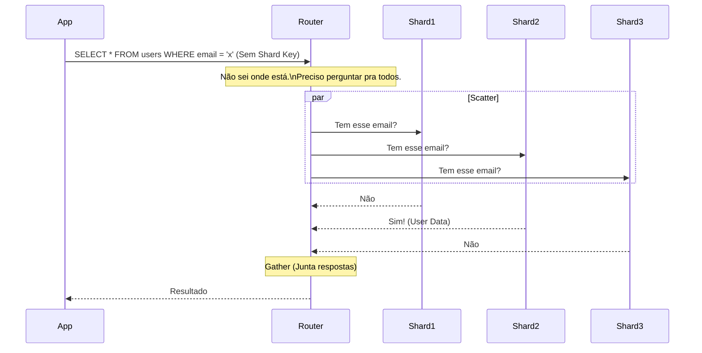
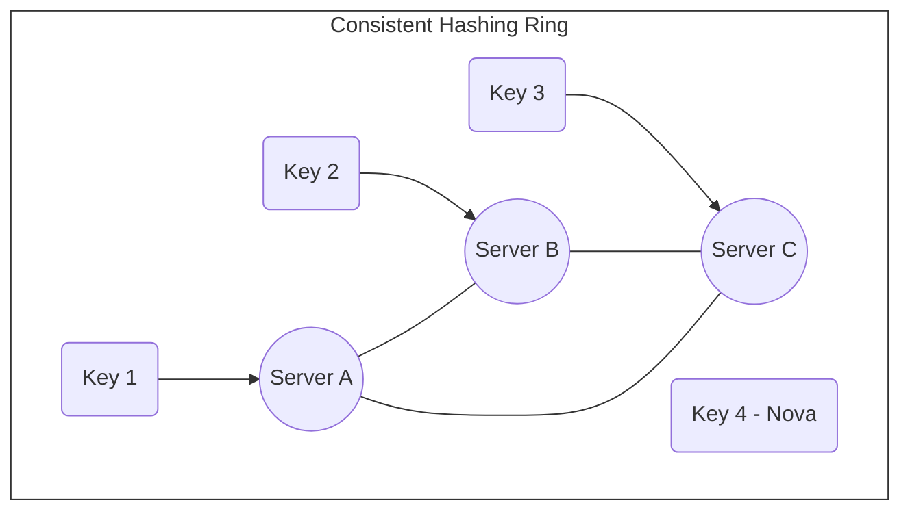
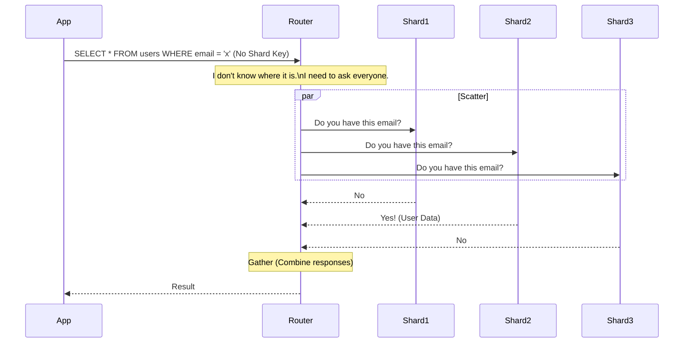

# Sharding e Particionamento: O Último Recurso da Escalabilidade

Por que dividir seu banco de dados deve ser sua última opção de escala, e não a primeira

---

Existe uma máxima em arquitetura de software: **"Não faça Sharding até que você esteja sangrando."**

Escalar leitura é "fácil": basta adicionar Réplicas de Leitura.
Escalar escrita, no entanto, é o problema difícil da computação distribuída. Quando um único nó *Master* não suporta mais o IOPS de escrita ou o tamanho do dataset excede o disco físico, a única saída é dividir os dados.

Neste artigo, vamos explorar as estratégias de particionamento, o problema do "Hot Partition" e a elegância matemática do **Consistent Hashing**.

---

### 1. Particionamento vs. Sharding: Qual a diferença?

Embora usados de forma intercambiável, há uma distinção técnica importante:

1.  **Particionamento (Lógico):** Ocorre dentro da mesma instância de banco de dados. Ex: *PostgreSQL Declarative Partitioning*.
    * **Objetivo:** Gerenciamento. Facilitar a exclusão de dados antigos (`DROP TABLE` é mais rápido que `DELETE WHERE date < x`) e melhorar performance de cache.
2.  **Sharding (Físico):** Os dados são espalhados por **servidores diferentes**.
    * **Objetivo:** Escala Horizontal Infinita. Se um servidor aguenta 1TB, 10 servidores aguentam 10TB.

---

### 2. Estratégias de Distribuição: Como escolher a chave (Shard Key)

A escolha da **Shard Key** é a decisão mais irreversível do seu projeto. Se você escolher errado, terá que migrar Petabytes de dados depois.

#### A. Key Based (Hash) Partitioning
Você pega o ID do cliente, aplica uma função de Hash e tira o módulo pelo número de servidores.
$$ ShardIndex = hash(CustomerID) \ \% \ N $$

* **Prós:** Distribuição uniforme de dados. Ótimo para prevenir hotspots.
* **Contras:** Consultas por intervalo (Range Queries) são impossíveis. `SELECT * FROM orders WHERE date > today` exige consultar **todos** os shards (Scatter-Gather).

#### B. Range Based Partitioning
Você divide por intervalos. Ex: IDs 1-1000 no Shard A, 1001-2000 no Shard B. Ou por Data (Janeiro no A, Fevereiro no B).

* **Prós:** Ótimo para queries temporais ou sequenciais.
* **Contras:** O problema do **Hot Partition**. Se sua chave for a data e estamos na Black Friday, todo o tráfego de escrita vai para o Shard "Novembro", enquanto os outros ficam ociosos. O sistema tomba.

#### C. Directory Based (Lookup)
Uma tabela central (ou serviço) diz onde está cada dado.
* **Prós:** Flexibilidade total. Você pode mover o "Cliente X" do Shard A para o B manualmente.
* **Contras:** Ponto único de falha e gargalo de performance (cada query exige um lookup antes).

---

### 3. O Pesadelo das Operações Cross-Shard

O Sharding quebra as garantias ACID do banco relacional.

Se você precisa fazer um JOIN entre a tabela `Users` (Shard A) e a tabela `Orders` (Shard B), o banco não consegue fazer isso nativamente.
Você tem duas opções terríveis:
1.  **Application Side Join:** Buscar dados de A, buscar de B, e cruzar os arrays em memória no código Java/Go.
2.  **Data Duplication:** Duplicar dados do usuário dentro do Shard de pedidos (Desnormalização extrema).

#### O Custo do Scatter-Gather
Imagine que você não tem a Shard Key na query. Você precisa perguntar para **todos** os nós.

Isso transforma uma operação $O(1)$ em $O(N)$, onde N é o número de shards. A latência será ditada pelo shard mais lento.

---

### 4. O Problema do Rebalancing e Consistent Hashing

O método clássico `hash(id) % N` funciona bem até você precisar adicionar um novo servidor.
Se você tem 10 servidores e adiciona o 11º, o resultado da conta muda para quase todas as chaves.
**Resultado:** Você precisa mover 90% dos dados de lugar. O banco para.

#### A Solução: Consistent Hashing
Usado pelo DynamoDB, Cassandra e Discord. Imagine um anel (Ring) de 0 a 360 graus.
1.  Os servidores são posicionados em pontos aleatórios do anel.
2.  A chave do dado também cai num ponto do anel.
3.  O dado pertence ao primeiro servidor que encontrar girando no sentido horário.

Quando você adiciona um **Server D** entre A e B, ele rouba apenas uma parte das chaves de B. O resto do cluster (A e C) não é afetado.
Isso permite escalar elasticamente sem derrubar o cluster para rebalanceamento massivo.

---

### 5. Unique IDs Globais (Snowflake)

Com Sharding, você perde o `AUTO_INCREMENT`.
Se o Shard A gerar o ID 100 e o Shard B gerar o ID 100, você tem uma colisão global.

Você precisa de IDs únicos distribuídos. UUIDs funcionam, mas são ruins para indexação (não sequenciais e grandes).
A solução da indústria (Twitter Snowflake):
* **Bit de Sinal (1 bit)**
* **Timestamp (41 bits):** Garante ordenação temporal.
* **Machine ID (10 bits):** Garante que máquinas diferentes não colidam.
* **Sequence (12 bits):** Permite gerar milhares de IDs por milissegundo na mesma máquina.

---

### Conclusão

Particionar é trocar problemas de **Hardware** (disco cheio, CPU alta) por problemas de **Software** (complexidade de query, consistência eventual, rebalanceamento).

Antes de particionar:
1.  Otimize suas queries.
2.  Adicione Caching (Redis).
3.  Separe Leitura de Escrita (Read Replicas).
4.  Compre um servidor maior (Vertical Scaling ainda é mais barato que a hora de engenharia para manter Sharding).

Só parta para o Sharding quando a física do servidor único se tornar o gargalo impossível.

---

## English Version

There's a maxim in software architecture: **"Don't shard until you're bleeding."**

Scaling reads is "easy": just add Read Replicas.
Scaling writes, however, is the hard problem in distributed computing. When a single Master node can no longer handle the write IOPS or the dataset size exceeds the physical disk, the only solution is to divide the data.

In this article, we'll explore partitioning strategies, the "Hot Partition" problem, and the mathematical elegance of **Consistent Hashing**.

---

### 1. Partitioning vs. Sharding: What's the Difference?

Although often used interchangeably, there's an important technical distinction:

1.  **Partitioning (Logical):** Occurs within the same database instance. E.g., *PostgreSQL Declarative Partitioning*.
    * **Objective:** Management. Facilitate deletion of old data (`DROP TABLE` is faster than `DELETE WHERE date < x`) and improve cache performance.
2.  **Sharding (Physical):** Data is spread across **different servers**.
    * **Objective:** Infinite Horizontal Scalability. If one server handles 1TB, 10 servers handle 10TB.

---

### 2. Distribution Strategies: How to choose the key (Shard Key)

The choice of the **Shard Key** is the most irreversible decision of your project. If you choose incorrectly, you'll have to migrate Petabytes of data later.

#### A. Key Based (Hash) Partitioning
You take the customer ID, apply a Hash function, and take the modulo by the number of servers.
$$ ShardIndex = hash(CustomerID) \ \% \ N $$

*   **Pros:** Uniform data distribution. Excellent for preventing hotspots.
*   **Cons:** Range queries are impossible. `SELECT * FROM orders WHERE date > today` requires querying **all** shards (Scatter-Gather).

#### B. Range Based Partitioning
You divide by intervals. E.g., IDs 1-1000 in Shard A, 1001-2000 in Shard B. Or by Date (January in A, February in B).

*   **Pros:** Excellent for temporal or sequential queries.
*   **Cons:** The **Hot Partition** problem. If your key is the date and it's Black Friday, all write traffic goes to the "November" Shard, while the others remain idle. The system crashes.

#### C. Directory Based (Lookup)
A central table (or service) tells you where each piece of data is.
*   **Pros:** Total flexibility. You can manually move "Customer X" from Shard A to B.
*   **Cons:** Single point of failure and performance bottleneck (each query requires a lookup beforehand).

---

### 3. The Nightmare of Cross-Shard Operations

Sharding breaks the ACID guarantees of a relational database.

If you need to perform a JOIN between the `Users` table (Shard A) and the `Orders` table (Shard B), the database cannot do this natively.
You have two terrible options:
1.  **Application Side Join:** Fetch data from A, fetch from B, and cross-reference the arrays in memory in your Java/Go code.
2.  **Data Duplication:** Duplicate user data within the orders Shard (Extreme denormalization).

#### The Cost of Scatter-Gather
Imagine you don't have the Shard Key in your query. You need to ask **all** nodes.

This turns an $O(1)$ operation into $O(N)$, where N is the number of shards. Latency will be dictated by the slowest shard.

---

### 4. The Rebalancing Problem and Consistent Hashing

The classic `hash(id) % N` method works well until you need to add a new server.
If you have 10 servers and add the 11th, the calculation result changes for almost all keys.
**Result:** You need to move 90% of the data. The database stops.

#### The Solution: Consistent Hashing
Used by DynamoDB, Cassandra, and Discord. Imagine a ring from 0 to 360 degrees.
1.  Servers are positioned at random points on the ring.
2.  The data key also falls at a point on the ring.
3.  The data belongs to the first server it encounters when moving clockwise.

When you add a **Server D** between A and B, it only "steals" a portion of B's keys. The rest of the cluster (A and C) is unaffected.
This allows for elastic scaling without bringing down the cluster for massive rebalancing.

---

### 5. Global Unique IDs (Snowflake)

With Sharding, you lose `AUTO_INCREMENT`.
If Shard A generates ID 100 and Shard B generates ID 100, you have a global collision.

You need distributed unique IDs. UUIDs work, but are poor for indexing (non-sequential and large).
The industry solution (Twitter Snowflake):
*   **Sign Bit (1 bit)**
*   **Timestamp (41 bits):** Guarantees temporal ordering.
*   **Machine ID (10 bits):** Ensures different machines don't collide.
*   **Sequence (12 bits):** Allows generating thousands of IDs per millisecond on the same machine.

---

### Conclusion

Partitioning is trading **Hardware** problems (full disk, high CPU) for **Software** problems (query complexity, eventual consistency, rebalancing).

Before partitioning:
1.  Optimize your queries.
2.  Add Caching (Redis).
3.  Separate Reads from Writes (Read Replicas).
4.  Buy a bigger server (Vertical Scaling is still cheaper than the engineering hours to maintain Sharding).

Only move to Sharding when the physics of a single server become the impossible bottleneck.

---

*This file is automatically generated and backed up from the blog system.*
*Last updated: 2025-12-04T18:59:49.584Z*
