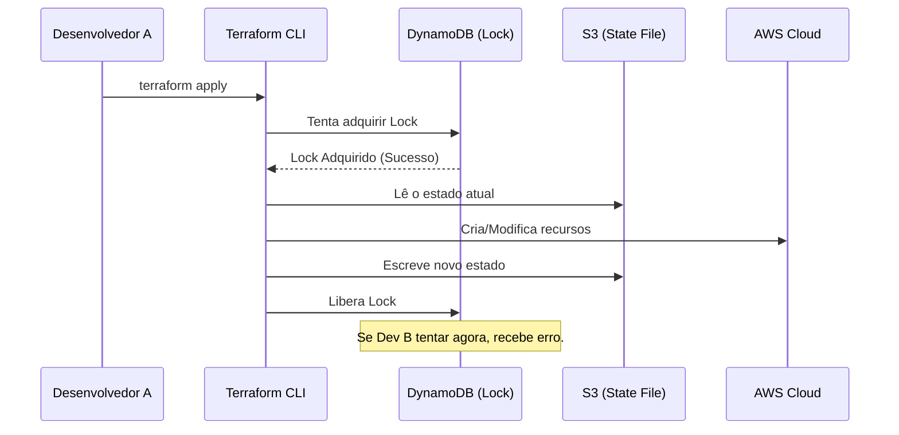
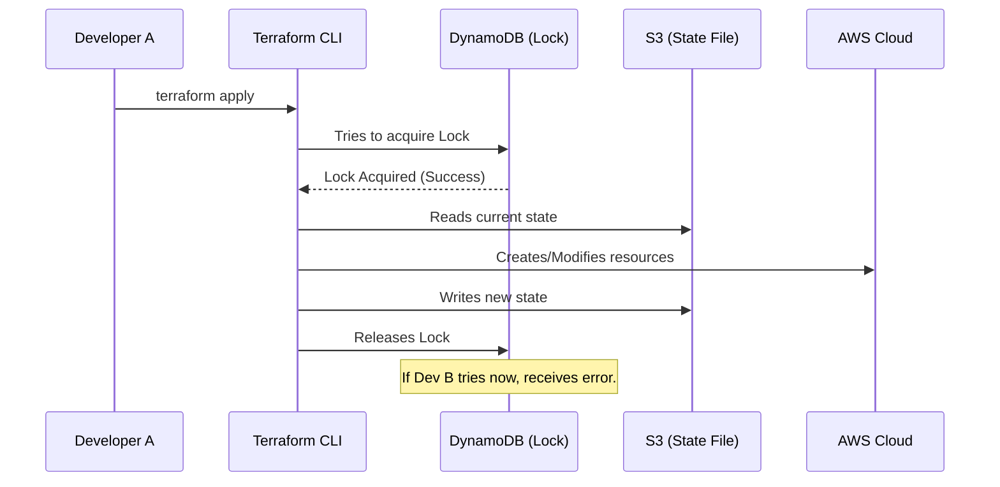

# Terraform: Do "ClickOps" à Engenharia de Infraestrutura Real

Por que scripts Bash não são IaC e como dominar o `tfstate` antes que ele destrua sua produção

---

Existe uma fase na vida de toda startup ou equipa de engenharia chamada **"ClickOps"**.
Você precisa de uma base de dados? Entra na consola da AWS, clica em RDS, escolhe o tamanho, configura a VPC manualmente e pronto.

Funciona? Sim. É escalável? Não.
Seis meses depois, precisa de criar um ambiente de *Staging* idêntico à Produção. Ninguém se lembra se marcou a caixa "Multi-AZ" ou qual Security Group foi usado. O resultado é o **Desvio de Configuração (Configuration Drift)**.

O Terraform resolve isto não apenas automatizando a criação, mas gerindo o **estado** da sua infraestrutura. Hoje, vamos mergulhar na arquitetura declarativa do Terraform e como sair do amadorismo manual.

---

### 1. Imperativo vs. Declarativo: A Mudança Mental

A maioria dos sysadmins cresceu escrevendo scripts (Bash, Python) para configurar servidores. Isso é **Imperativo**.
* *"Crie uma VM. Depois instale o Nginx. Depois abra a porta 80."*

O problema: Se o script falhar no passo 2, e você correr de novo, ele tenta criar a VM novamente e falha (duplicidade). Você precisa escrever muita lógica de "IF EXISTS" para torná-lo idempotente.

O Terraform é **Declarativo**.
* *"Eu quero que exista uma VM com Nginx e porta 80."*

Você descreve o **Estado Final Desejado**. O Terraform calcula a rota para chegar lá.


---

### 2. A Anatomia do HCL (HashiCorp Configuration Language)

O Terraform não usa JSON ou YAML (embora suporte JSON). Ele usa HCL, uma linguagem desenhada para descrever grafos de recursos.

Vamos criar uma arquitetura real: Uma instância EC2 dentro de uma VPC com um Security Group.

```hcl
provider "aws" {
  region = "us-east-1"
}

# 1. Definimos o recurso (O Quê)
resource "aws_instance" "app_server" {
  ami           = "ami-0c55b159cbfafe1f0" 
  instance_type = "t3.micro"
  
  # Referência implícita! O Terraform entende que precisa criar o SG antes da instância
  vpc_security_group_ids = [aws_security_group.allow_web.id]

  tags = {
    Name = "Production-App"
  }
}

# 2. Definimos a Segurança
resource "aws_security_group" "allow_web" {
  name        = "allow_web_traffic"
  description = "Allow inbound HTTP"

  ingress {
    description = "HTTP from VPC"
    from_port   = 80
    to_port     = 80
    protocol    = "tcp"
    cidr_blocks = ["0.0.0.0/0"]
  }
}
```

**Onde está a mágica?**
Note a linha `vpc_security_group_ids = [aws_security_group.allow_web.id]`.
Eu não disse ao Terraform "crie o Security Group primeiro". Ele montou um **Grafo de Dependências (DAG)**, percebeu que a instância depende do grupo, e ordenou a criação automaticamente.

---

### 3. O Coração do Terraform: O `terraform.tfstate`

Aqui é onde a maioria dos incidentes acontece.
O Terraform não consulta a nuvem o tempo todo. Ele consulta um arquivo chamado `terraform.tfstate`.

Este arquivo é um JSON que mapeia os seus recursos do código (`aws_instance.app_server`) para os IDs reais do mundo físico (`i-0123456789abcdef0`).

Se você apagar este arquivo, o Terraform sofre de amnésia. Ele achará que nada existe e tentará criar tudo de novo, duplicando custos ou falhando por conflito de nomes.

#### O Problema do "State Locking" em Equipas
Imagine que o **Dev A** roda `terraform apply`.
Ao mesmo tempo, o **Dev B** roda `terraform apply` para mudar outra coisa.
Ambos tentam escrever no `tfstate` ao mesmo tempo. **O arquivo corrompe.** A infraestrutura quebra.

**A Solução Enterprise:** Remote State com Locking.
Nunca guarde o state no Git. Use um Backend que suporte trava.

* **S3 (Armazenamento):** Guarda o JSON do state.
* **DynamoDB (Locking):** Cria uma tabela que funciona como um semáforo. Se o Dev A está rodando o deploy, o DynamoDB escreve um ID de trava. O Dev B recebe um erro: *"Error: State locked by another user"*.



---

### 4. O Ciclo da Verdade: Plan e Apply

A maior vantagem do Terraform sobre scripts é a **previsibilidade**.

#### `terraform plan`
Este comando é uma simulação. Ele compara:
1.  O seu código `.tf`.
2.  O arquivo `tfstate`.
3.  A realidade na Cloud (fazendo chamadas de API de leitura).

Ele gera um plano de execução.
* `+` (Verde): Vai criar.
* `-` (Vermelho): Vai destruir (Cuidado!).
* `~` (Amarelo): Vai modificar in-place.

**Regra de Ouro:** Em pipelines de CI/CD (GitHub Actions/GitLab CI), o passo de `plan` deve ser obrigatório e requerer aprovação manual antes do `apply` se houver destruição de recursos críticos.

---

### 5. Drift Detection: Quando a Realidade diverge do Código

O que acontece se alguém entrar na consola da AWS e mudar o tamanho da instância de `t3.micro` para `t3.large` manualmente?

Isso é **Configuration Drift**.
Na próxima vez que você rodar `terraform plan`, o Terraform vai detectar:
*"Ei, o código diz `micro`, mas a realidade é `large`."*

Ele vai propor:
`~ update instance type: t3.large -> t3.micro`

Isso garante que a infraestrutura esteja sempre sincronizada com a documentação (o código). O Terraform "conserta" as alterações manuais não autorizadas.

---

### Conclusão

Terraform não é apenas sobre não clicar em botões. É sobre:
1.  **Documentação Viva:** O código é a verdade.
2.  **Reprodutibilidade:** Staging é igual a Produção.
3.  **Segurança:** Com *State Locking* e *Plans*, você elimina o "Oops, apaguei o banco errado".

Se a sua infraestrutura ainda vive na cabeça de um SysAdmin ou em scripts Bash espalhados, você não tem infraestrutura; você tem um animal de estimação (`Pet`) esperando para morrer. Transforme-a em gado (`Cattle`) com Terraform.

---

## English Version

There's a stage in the life of every startup or engineering team called **"ClickOps"**.
Need a database? Go to the AWS console, click on RDS, choose the size, configure the VPC manually, and you're done.

Does it work? Yes. Is it scalable? No.
Six months later, you need to create a *Staging* environment identical to Production. No one remembers if they checked the "Multi-AZ" box or which Security Group was used. The result is **Configuration Drift**.

Terraform solves this not only by automating creation but by managing the **state** of your infrastructure. Today, we'll dive into Terraform's declarative architecture and how to move beyond manual amateurism.

---

### 1. Imperative vs. Declarative: The Mental Shift

Most sysadmins grew up writing scripts (Bash, Python) to configure servers. This is **Imperative**.
* *"Create a VM. Then install Nginx. Then open port 80."*

The problem: If the script fails in step 2, and you run it again, it tries to create the VM again and fails (duplication). You need to write a lot of "IF EXISTS" logic to make it idempotent.

Terraform is **Declarative**.
* *"I want a VM to exist with Nginx and port 80."*

You describe the **Desired End State**. Terraform calculates the route to get there.

---

### 2. The Anatomy of HCL (HashiCorp Configuration Language)

Terraform doesn't use JSON or YAML (although it supports JSON). It uses HCL, a language designed to describe resource graphs.

Let's create a real architecture: An EC2 instance inside a VPC with a Security Group.

```hcl
provider "aws" {
  region = "us-east-1"
}

# 1. We define the resource (What)
resource "aws_instance" "app_server" {
  ami           = "ami-0c55b159cbfafe1f0" 
  instance_type = "t3.micro"
  
  # Implicit reference! Terraform understands that it needs to create the SG before the instance
  vpc_security_group_ids = [aws_security_group.allow_web.id]

  tags = {
    Name = "Production-App"
  }
}

# 2. We define the Security
resource "aws_security_group" "allow_web" {
  name        = "allow_web_traffic"
  description = "Allow inbound HTTP"

  ingress {
    description = "HTTP from VPC"
    from_port   = 80
    to_port     = 80
    protocol    = "tcp"
    cidr_blocks = ["0.0.0.0/0"]
  }
}
```

**Where's the magic?**
Note the line `vpc_security_group_ids = [aws_security_group.allow_web.id]`.
I didn't tell Terraform "create the Security Group first." It assembled a **Directed Acyclic Graph (DAG)**, realized that the instance depends on the group, and ordered the creation automatically.

---

### 3. The Heart of Terraform: The `terraform.tfstate`

This is where most incidents happen.
Terraform doesn't query the cloud all the time. It queries a file called `terraform.tfstate`.

This file is a JSON that maps your resources from the code (`aws_instance.app_server`) to the real IDs in the physical world (`i-0123456789abcdef0`).

If you delete this file, Terraform suffers from amnesia. It will think that nothing exists and will try to create everything again, duplicating costs or failing due to name conflicts.

#### The Problem of "State Locking" in Teams
Imagine that **Dev A** runs `terraform apply`.
At the same time, **Dev B** runs `terraform apply` to change something else.
Both try to write to `tfstate` at the same time. **The file corrupts.** The infrastructure breaks.

**The Enterprise Solution:** Remote State with Locking.
Never save the state in Git. Use a Backend that supports locking.

* **S3 (Storage):** Stores the JSON of the state.
* **DynamoDB (Locking):** Creates a table that works like a semaphore. If Dev A is running the deploy, DynamoDB writes a lock ID. Dev B receives an error: *"Error: State locked by another user"*.



---

### 4. The Cycle of Truth: Plan and Apply

Terraform's biggest advantage over scripts is **predictability**.

#### `terraform plan`
This command is a simulation. It compares:
1.  Your `.tf` code.
2.  The `tfstate` file.
3.  The reality in the Cloud (making read API calls).

It generates an execution plan.
* `+` (Green): Will create.
* `-` (Red): Will destroy (Careful!).
* `~` (Yellow): Will modify in-place.

**Golden Rule:** In CI/CD pipelines (GitHub Actions/GitLab CI), the `plan` step should be mandatory and require manual approval before the `apply` if there is destruction of critical resources.

---

### 5. Drift Detection: When Reality Diverges from Code

What happens if someone goes into the AWS console and changes the instance size from `t3.micro` to `t3.large` manually?

This is **Configuration Drift**.
The next time you run `terraform plan`, Terraform will detect:
*"Hey, the code says `micro`, but the reality is `large`."*

It will propose:
`~ update instance type: t3.large -> t3.micro`

This ensures that the infrastructure is always synchronized with the documentation (the code). Terraform "fixes" unauthorized manual changes.

---

### Conclusion

Terraform isn't just about not clicking buttons. It's about:
1.  **Living Documentation:** The code is the truth.
2.  **Reproducibility:** Staging is the same as Production.
3.  **Security:** With *State Locking* and *Plans*, you eliminate the "Oops, I deleted the wrong database".

If your infrastructure still lives in the head of a SysAdmin or in scattered Bash scripts, you don't have infrastructure; you have a pet waiting to die. Turn it into cattle with Terraform.


---

*This file is automatically generated and backed up from the blog system.*
*Last updated: 2025-12-16T05:59:56.863Z*
