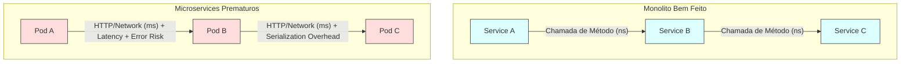
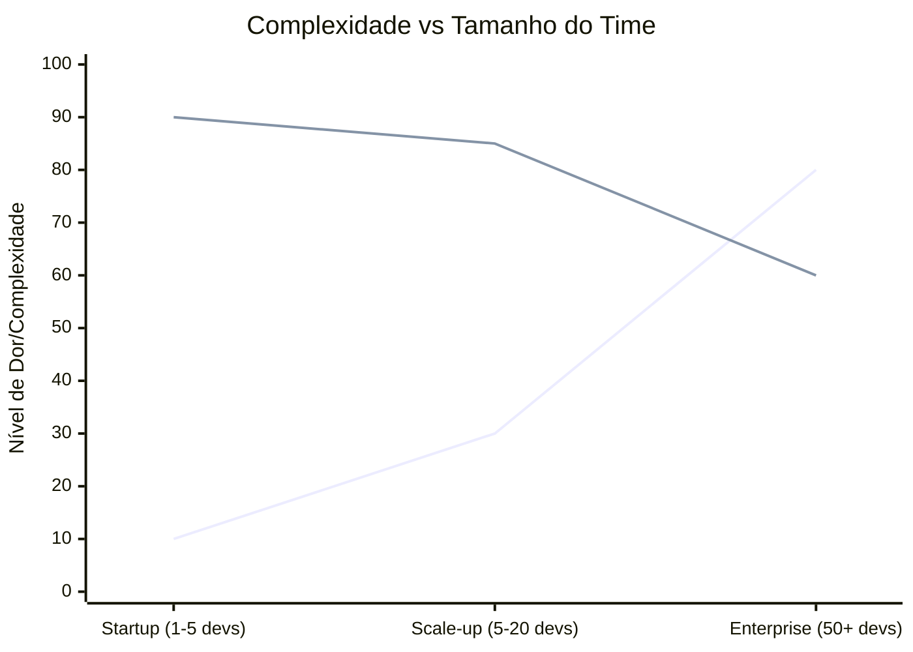
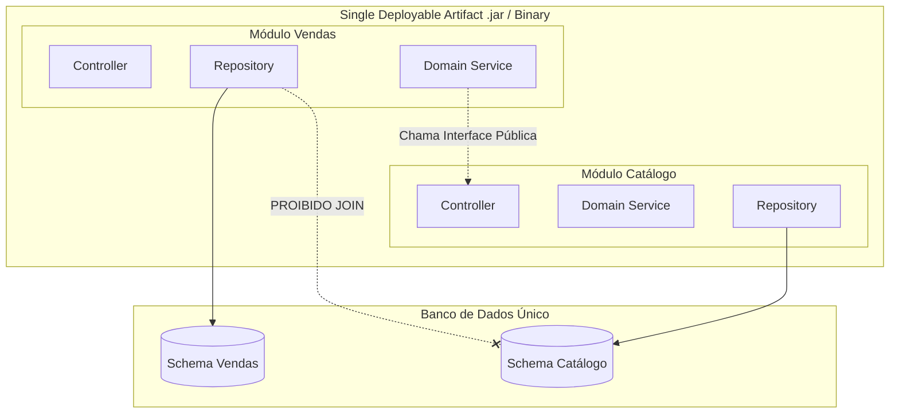
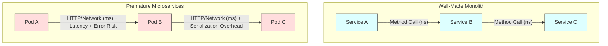
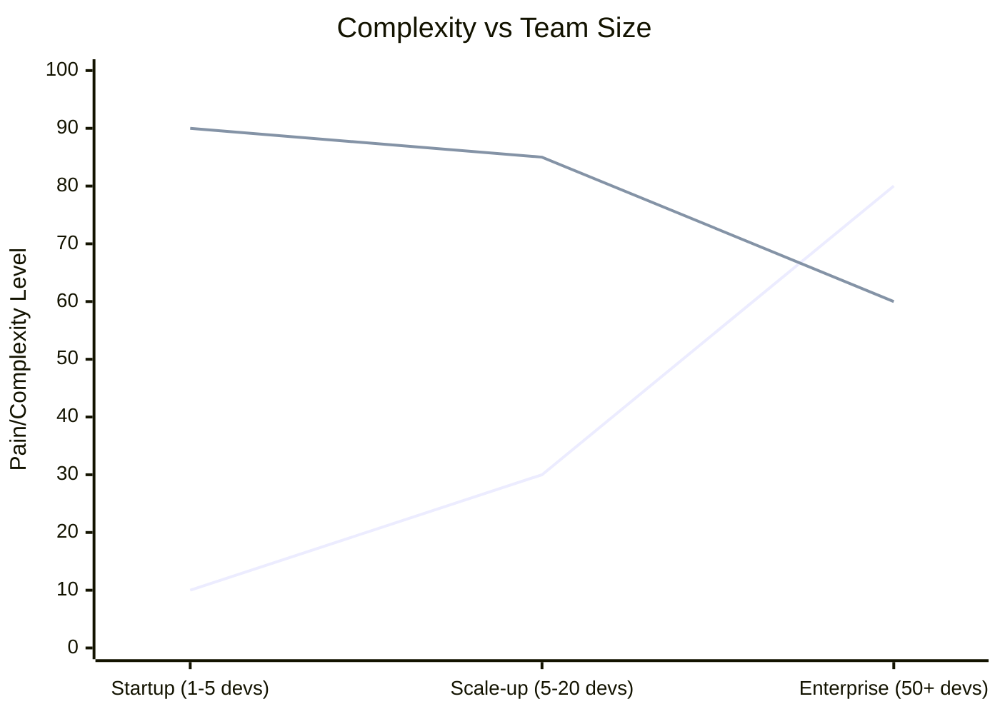
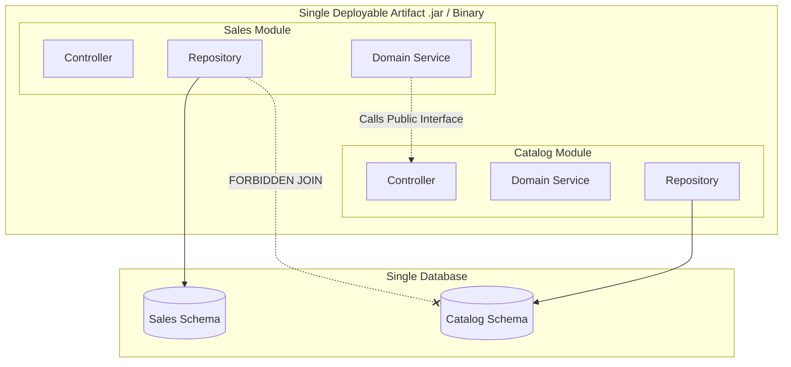

# Você não é a Netflix: Por que o Monolito Modular é a arquitetura que você precisa agora

Como evitar o "Monolito Distribuído" e começar sua arquitetura com sanidade e escalabilidade

---

Existe um ciclo vicioso no desenvolvimento de software moderno:
1.  Uma startup nasce.
2.  O Tech Lead lê o blog de engenharia da Netflix ou do Uber.
3.  O time de 3 desenvolvedores decide criar 15 microsserviços rodando em um cluster Kubernetes complexo.
4.  Seis meses depois, eles gastam 80% do tempo debugando erros de rede e tracing distribuído, e 20% entregando valor.

Este fenômeno é conhecido como **Otimização Prematura de Infraestrutura**.

Neste artigo, vamos defender uma abordagem impopular, mas extremamente eficaz: começar com um **Monolito Modular**. Vamos ver por que microsserviços no "Day 1" são geralmente um erro e como desenhar um monolito que pode ser quebrado facilmente no futuro.

---

### O Problema: O "Monolito Distribuído"

O maior erro não é escolher microsserviços, é escolhê-los pelos motivos errados (hype) ou no momento errado (cedo demais).

Quando você separa seu domínio em serviços físicos (Deployments diferentes) sem entender as fronteiras do domínio (Bounded Contexts), você não cria microsserviços desacoplados. Você cria um **Monolito Distribuído**.

Isso combina o pior de dois mundos:
* A complexidade de deploy dos microsserviços.
* O acoplamento rígido do monolito.

#### O Pesadelo da Latência e Consistência

Em um monolito, uma chamada de função leva **nanosegundos** e a consistência é garantida pelo banco (ACID).
Em microsserviços, essa mesma interação vira uma chamada HTTP/gRPC que leva **milissegundos**, pode falhar (Network Partition), e exige consistência eventual.

---

### A Solução: O Monolito Modular

O oposto de "Microsserviço" não é "Monolito Espaguete" (Big Ball of Mud). O caminho do meio é o **Monolito Modular**.

A ideia é simples: **Separação Lógica, não Física.**

Você constrói módulos independentes (User, Catalog, Payment) dentro do mesmo repositório e do mesmo processo de deploy. Eles têm regras estritas de visibilidade (ex: classes `internal` ou `package-private`).

#### A Regra de Ouro do Monolito Modular
Um módulo não pode acessar a tabela do banco de dados de outro módulo.
* **Errado:** O módulo `Checkout` faz um `JOIN` na tabela `Users`.
* **Certo:** O módulo `Checkout` chama a API pública (interface Java/Go) do módulo `User`.

Isso garante que, no dia em que você *realmente* precisar escalar o Checkout separadamente, a refatoração será apenas "copiar e colar" código para um novo projeto, pois o desacoplamento de dados já existe.

---

### Comparativo de Complexidade Operacional

Vamos analisar o custo de complexidade ao longo do tempo. Microsserviços impõem um "imposto inicial" (Infrastructure Tax) altíssimo. Se o seu produto ainda não tem *Product-Market Fit* claro, esse imposto pode matar a empresa.

* **Linha 1 (Crescente):** Monolito. Começa fácil, fica difícil se não for modularizado conforme o time cresce.
* **Linha 2 (Decrescente):** Microsserviços. Começa extremamente doloroso para times pequenos, e só "se paga" quando o time é grande o suficiente para justificar a autonomia.

---

### Quando migrar? (O Checklist da Realidade)

Não migre por hype. Migre por dor. Aqui estão os únicos motivos válidos para extrair um serviço do seu Monolito Modular:

1.  **Lei de Conway (Escala Organizacional):**
    O time cresceu tanto (ex: 50 pessoas) que eles estão pisando no pé uns dos outros no mesmo repo. O tempo de merge/deploy ficou lento demais.

2.  **Necessidades de Hardware Distintas:**
    O módulo de `Processamento de Imagem` precisa de GPU e consome muita memória, derrubando a API REST de `Cadastro`. Faz sentido extrair apenas esse módulo para escalar hardware de forma independente.

3.  **Ciclo de Vida de Deploy:**
    O módulo de `Core Banking` muda uma vez por mês (muito risco). O módulo de `Marketing` muda 10 vezes por dia. Separar permite que o Marketing corra sem risco de quebrar o Banco.

---

### Arquitetura de Referência: Começando do Jeito Certo

Como desenhar sua arquitetura hoje para não se arrepender amanhã?

Use **Domain-Driven Design (DDD)** para definir os Bounded Contexts, mas mantenha-os juntos.

### Vantagens desta abordagem:
1.  **Refatoração:** Mover uma classe de pacote é trivial na IDE. Mover endpoint entre microsserviços é um projeto.
2.  **Transações:** Você ainda tem `ACID`. Você pode usar `@Transactional` entre Vendas e Estoque. Em microsserviços, você precisaria implementar *Sagas* ou *Two-Phase Commit* (complexidade absurda).
3.  **Debug:** Você coloca um breakpoint e segue o fluxo inteiro. Não precisa de Jaeger/Zipkin configurado no dia 1.

---

### Conclusão

Martin Fowler disse: *"A primeira regra dos objetos distribuídos é: não distribua."*

Começar com microsserviços é como comprar um caminhão de 18 rodas para entregar uma pizza. É potente, é impressionante, mas você vai gastar mais tempo tentando estacionar do que entregando valor.

Comece com um Monolito Modular. Respeite as fronteiras dos módulos. Isole os dados. E só quebre o vidro em caso de emergência real de escala.

**Sua arquitetura deve evoluir com seu negócio, não tentar adivinhar o futuro.**

---

## English Version

There's a vicious cycle in modern software development:
1.  A startup is born.
2.  The Tech Lead reads the engineering blog of Netflix or Uber.
3.  The team of 3 developers decides to create 15 microservices running on a complex Kubernetes cluster.
4.  Six months later, they spend 80% of their time debugging network errors and distributed tracing, and 20% delivering value.

This phenomenon is known as **Premature Infrastructure Optimization**.

In this article, we will defend an unpopular but extremely effective approach: starting with a **Modular Monolith**. Let's see why microservices on "Day 1" are usually a mistake and how to design a monolith that can be easily broken down in the future.

---

### The Problem: The "Distributed Monolith"

The biggest mistake is not choosing microservices, it's choosing them for the wrong reasons (hype) or at the wrong time (too early).

When you separate your domain into physical services (different Deployments) without understanding the domain boundaries (Bounded Contexts), you don't create decoupled microservices. You create a **Distributed Monolith**.

This combines the worst of both worlds:
* The deployment complexity of microservices.
* The rigid coupling of the monolith.

#### The Nightmare of Latency and Consistency

In a monolith, a function call takes **nanoseconds** and consistency is guaranteed by the database (ACID).
In microservices, that same interaction becomes an HTTP/gRPC call that takes **milliseconds**, can fail (Network Partition), and requires eventual consistency.

---

### The Solution: The Modular Monolith

The opposite of "Microservice" is not "Spaghetti Monolith" (Big Ball of Mud). The middle ground is the **Modular Monolith**.

The idea is simple: **Logical Separation, not Physical.**

You build independent modules (User, Catalog, Payment) within the same repository and the same deployment process. They have strict visibility rules (e.g., `internal` or `package-private` classes).

#### The Golden Rule of the Modular Monolith
One module cannot access another module's database table.
* **Wrong:** The `Checkout` module does a `JOIN` on the `Users` table.
* **Right:** The `Checkout` module calls the public API (Java/Go interface) of the `User` module.

This ensures that, on the day you *really* need to scale Checkout separately, the refactoring will be just "copy and paste" code to a new project, as the data decoupling already exists.

---

### Operational Complexity Comparison

Let's analyze the cost of complexity over time. Microservices impose a very high "initial tax" (Infrastructure Tax). If your product doesn't have clear *Product-Market Fit* yet, this tax can kill the company.

* **Line 1 (Increasing):** Monolith. Starts easy, gets difficult if not modularized as the team grows.
* **Line 2 (Decreasing):** Microservices. Starts extremely painful for small teams, and only "pays off" when the team is large enough to justify the autonomy.

---

### When to migrate? (The Reality Checklist)

Don't migrate for hype. Migrate for pain. Here are the only valid reasons to extract a service from your Modular Monolith:

1.  **Conway's Law (Organizational Scale):**
    The team has grown so much (e.g., 50 people) that they are stepping on each other's toes in the same repo. The merge/deploy time has become too slow.

2.  **Distinct Hardware Needs:**
    The `Image Processing` module needs GPU and consumes a lot of memory, crashing the `Registration` REST API. It makes sense to extract only that module to scale hardware independently.

3.  **Deployment Lifecycle:**
    The `Core Banking` module changes once a month (very risky). The `Marketing` module changes 10 times a day. Separating allows Marketing to run without the risk of breaking the Bank.

---

### Reference Architecture: Starting the Right Way

How to design your architecture today so you don't regret it tomorrow?

Use **Domain-Driven Design (DDD)** to define the Bounded Contexts, but keep them together.

### Advantages of this approach:
1.  **Refactoring:** Moving a class between packages is trivial in the IDE. Moving an endpoint between microservices is a project.
2.  **Transactions:** You still have `ACID`. You can use `@Transactional` between Sales and Inventory. In microservices, you would need to implement *Sagas* or *Two-Phase Commit* (absurd complexity).
3.  **Debug:** You set a breakpoint and follow the entire flow. You don't need Jaeger/Zipkin configured on day 1.

---

### Conclusion

Martin Fowler said: *"The first rule of distributed objects is: don't distribute."*

Starting with microservices is like buying an 18-wheeler truck to deliver a pizza. It's powerful, it's impressive, but you'll spend more time trying to park than delivering value.

Start with a Modular Monolith. Respect the module boundaries. Isolate the data. And only break the glass in case of a real scaling emergency.

**Your architecture should evolve with your business, not try to guess the future.**

---

*This file is automatically generated and backed up from the blog system.*
*Last updated: 2025-12-10T01:50:15.786Z*
